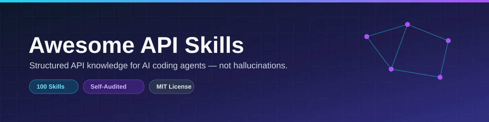

# Stop your AI from guessing APIs

**Your agent hallucinates endpoints. These skills fix that.**

LLMs invent Stripe webhook names, use deprecated SDK methods, and mix test and live keys. Pasting docs into chat is slow and inconsistent.

**Awesome API Skills** gives your agent structured, validated API knowledge — 100 skills with examples, pitfalls, and a knowledge graph that shows what to use together.

```bash
git clone https://github.com/ashish7802/awesome-api-skills.git
cd awesome-api-skills
pnpm install && pnpm build && pnpm dev
```

Then open **Skills** in the docs site, or copy `skills/stripe/` into your project and point your agent at `SKILL.md`.

---

## The problem → the outcome

| Without skills | With skills |
| :--- | :--- |
| Agent guesses SDK version | Exact patterns from `SKILL.md` |
| Invented webhook payloads | Documented event types + verification steps |
| Random stack choices | Knowledge graph shows prerequisites & alternatives |
| Paste 10 pages of docs every session | One skill folder in your repo context |

Works with **Cursor**, **Claude Code**, **Cline**, **Continue**, and any agent that reads markdown.

---

## What's inside

| | |
| :--- | :--- |
| **100 skills** | Stripe, PostgreSQL, Next.js, AWS S3, Twilio, OpenAI, and 94 more |
| **AI pitfalls** | Common LLM mistakes per skill — what agents get wrong |
| **Production checklists** | Ship-ready reminders, not tutorial fluff |
| **Knowledge graph** | Prerequisites, alternatives, recommended stacks — explore at `/graph` after `pnpm dev` |
| **Trust metadata** | Schema version, validation status, doc sources on every skill |

---

## 30-second start

**Option A — Browse locally**

```bash
pnpm dev   # → http://localhost:5173/skills/
```

**Option B — Use in your project**

```bash
cp -r skills/stripe .cursor/skills/stripe   # or .skills/, agent-specific path
# Tell your agent: "Follow .cursor/skills/stripe/SKILL.md for payment work"
```

**Option C — CLI search** (after `pnpm build`)

```bash
node packages/cli/dist/bin.js search payment
node packages/cli/dist/bin.js doctor
```

> CLI is not on npm yet — build from source.

---

## Popular stacks (from the knowledge graph)

| Stack | Skills |
| :--- | :--- |
| Full-stack TypeScript | `nextjs` → `prisma` → `postgresql` |
| Payments SaaS | `stripe` + `express` + `postgresql` |
| AI app | `openai` + `pinecone` + `vercel` |
| Auth | `clerk` or `auth0` + `nextjs` |

See the full graph: run `pnpm dev` → **Graph** in the nav.

---

## Trust

- **100 skills** — count `skills/` yourself
- **28 tests** — `pnpm test`
- **MIT license**
- Honesty audit: [`TRUST_REPORT.md`](TRUST_REPORT.md)

---

## Contributing

[`CONTRIBUTING.md`](CONTRIBUTING.md) · [`SPECIFICATION.md`](SPECIFICATION.md)

---

<div align="center">
  
  <br />
  <a href="https://github.com/ashish7802/awesome-api-skills"></a>
  <a href="https://github.com/ashish7802/awesome-api-skills/actions/workflows/build.yml"></a>
</div>
