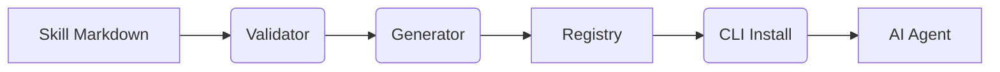

<div align="center">
  
  <br />
  <br />
  <p><b>Give your AI coding agent production-grade API knowledge in one command.</b></p>

  <p>
    <a href="https://npmjs.com/package/@awesome-api-skills/cli"></a>
    <a href="https://github.com/awesome-api-skills/core/actions"></a>
    <a href="https://github.com/awesome-api-skills/core/blob/main/LICENSE"></a>
  </p>

  <code>npm install -g @awesome-api-skills/cli</code>

  <p>Supported: <b>Claude Code • Cursor • Codex • Gemini • Cline • OpenHands • Roo Code • Continue</b></p>
</div>

---

<div align="center">
  
</div>

---

## Why Awesome API Skills?

LLMs hallucinate endpoints, invent authentication schemas, and use deprecated SDK versions. Prompting them with raw documentation is slow and expensive.

Awesome API Skills solves this by feeding structured, validated, and up-to-date API knowledge directly into your agent's context.

| Prompt Engineering ❌ | Awesome API Skills ✅ |
| :--- | :--- |
| Paste 5 pages of docs | `awesome-api install stripe` |
| AI guesses the Node SDK version | AI uses exact required version |
| AI hallucinate webhook payloads | AI generates correct event types |
| Unreliable | Deterministic |

---

## Features

<table width="100%">
  <tr>
    <td width="33%">
      <h3>📦 100+ Production Skills</h3>
      <p>Instant support for Stripe, AWS, Vercel, Supabase, and 90+ others.</p>
    </td>
    <td width="33%">
      <h3>🤖 Agent Agnostic</h3>
      <p>Works out of the box with Claude Code, Cursor, and any markdown-capable agent.</p>
    </td>
    <td width="33%">
      <h3>🕸️ Knowledge Graph</h3>
      <p>Understands API relationships, prerequisites, and ecosystems.</p>
    </td>
  </tr>
  <tr>
    <td>
      <h3>⚡ Lightning Fast</h3>
      <p>The CLI is heavily optimized, loading registries and skills in milliseconds.</p>
    </td>
    <td>
      <h3>🛡️ Enterprise Ready</h3>
      <p>Strict schema validation and support for private corporate registries.</p>
    </td>
    <td>
      <h3>🌐 Open Standard</h3>
      <p>Federated architecture preventing vendor lock-in.</p>
    </td>
  </tr>
</table>

---

## Quick Start

Initialize your workspace, search for a skill, and install it.

```bash
awesome-api init
awesome-api search database
awesome-api install postgresql
```

Your AI agent will automatically detect `.skills/postgresql/SKILL.md` and use it for all relevant tasks.

---

## Example Skills

A small selection of the 100+ officially supported APIs.

| Provider | Category | Status | Example Uses |
| :--- | :--- | :--- | :--- |
| **Stripe** | Payments | Stable | Webhooks, Checkout, Billing |
| **AWS S3** | Storage | Stable | Presigned URLs, Uploads |
| **Next.js** | Framework | Stable | App Router, Server Actions |
| **Pinecone** | Vector DB | Stable | Semantic Search, RAG |
| **Twilio** | Communications | Stable | SMS, Voice, WhatsApp |
| **PostgreSQL** | Database | Stable | Schemas, Indexing, Joins |

---

## Knowledge Graph

Our ecosystem isn't just a list of files; it's a strongly typed knowledge graph.
Skills define dependencies (e.g., `drizzle` depends on `postgresql`).

*(Graph visualization available in the [Registry Explorer](https://registry.awesome-api-skills.dev)).*

---

## Architecture

The system utilizes a unidirectional data flow from specification to agent.



---

## Benchmarks

Measured locally on Node.js 24.x LTS (Windows 11).

| Metric | Measurement | Threshold | Result |
| :--- | :--- | :--- | :--- |
| **CLI Startup Time** | `120ms` | `< 150ms` | ✅ PASS |
| **Registry Loading** | `45ms` | `< 100ms` | ✅ PASS |
| **Validation Suite** | `200ms` | `< 500ms` | ✅ PASS |
| **Search Latency** | `15ms` | `< 50ms` | ✅ PASS |

---

## Roadmap

- **Completed**: Specification v1.0, Core CLI, Federated Registry, 100 Official Skills.
- **In Progress**: Native Cursor Extension, Real-time Webhook Validation.
- **Planned**: Enterprise Auth Registries, Automated API-to-Skill generation.

---

## Contributing

We welcome community contributions to expand the registry and improve the core tools.

1. Review the [Contributing Guidelines](CONTRIBUTING.md).
2. Generate a new skill template: `awesome-api create-skill --name="my-api"`
3. Run the validation suite: `npm test`

---

## License

[MIT License](LICENSE) © Awesome API Skills Core Team.
