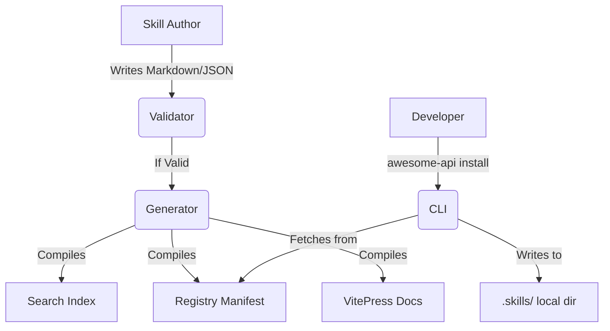

<div align="center">
  
  
  <br />
  <br />
  
  <h1>Awesome API Skills</h1>
  <p><b>The world's largest collection of installable AI coding skills for APIs.</b></p>

  <p>
    <a href="https://npmjs.com/package/@awesome-api-skills/cli"></a>
    <a href="https://github.com/awesome-api-skills/core/actions"></a>
    <a href="https://github.com/awesome-api-skills/core/blob/main/LICENSE"></a>
  </p>

  <p>
    <code>npx @awesome-api-skills/cli init</code>
  </p>

  <p>
    <a href="https://docs.awesome-api-skills.dev"><strong>Explore the Documentation</strong></a> ·
    <a href="https://registry.awesome-api-skills.dev"><strong>Browse the Registry</strong></a>
  </p>
</div>

<hr />

## 🚨 The Problem

LLMs are exceptional at writing code, but they are consistently terrible at utilizing modern, complex APIs. Without exact, up-to-date context, they hallucinate endpoints, use deprecated SDK versions, invent authentication schemas, and ignore subtle pagination rules.

Developers waste hours copying and pasting API references into chat windows just to get a single integration working.

## 💡 The Solution

**Awesome API Skills** is an open-source, federated ecosystem of machine-readable API specifications. It transforms standard API documentation into dense, validated **Skills** that AI agents (like GitHub Copilot, Anthropic Claude, and Google Gemini) can consume instantly.

Instead of pasting documentation into a prompt, you simply install the skill into your repository:

```bash
awesome-api install stripe
```

Your AI agent immediately understands how to properly authenticate, paginate, and construct webhooks for Stripe—with zero hallucinations.

---

## ✨ Features

The ecosystem is split into distinct, highly modular packages:

### Core Platform
- **The Specification (`SPECIFICATION.md`)**: The canonical open-source standard for defining an AI-readable API skill.
- **SDK (`@awesome-api-skills/sdk`)**: A lightweight, isomorphic TypeScript library for interacting with the specification programmatically.

### Tooling
- **CLI (`@awesome-api-skills/cli`)**: The robust terminal interface for discovering, validating, and installing skills into your local workspace.
- **Validator (`@awesome-api-skills/validator`)**: A strict, staged quality gate. Checks JSON schemas, markdown structures, broken links, and metadata integrity.
- **Generator (`@awesome-api-skills/generator`)**: The build pipeline. Compiles raw markdown and JSON into optimized search indexes, documentation, and registry manifests.

### Ecosystem
- **Registry (`@awesome-api-skills/registry`)**: A federated architecture supporting official, community, enterprise, and local registries.
- **Documentation (`@awesome-api-skills/docs`)**: A lightning-fast VitePress site auto-generated from the active registry.

---

## ⚡ Quick Start

You can reach your first successful skill installation in under 60 seconds.

### 1. Initialize the CLI
```bash
npx @awesome-api-skills/cli init
```

### 2. Search for a Skill
```bash
npx @awesome-api-skills/cli search "payments"
```

### 3. Install the Skill
```bash
npx @awesome-api-skills/cli install stripe
```
*Your workspace is now equipped with the Stripe skill. Your AI agent can read it from the `.skills/` directory.*

---

## 💻 Live Examples

### Validation Output
The CLI runs strict diagnostics before allowing a skill to be published:
```text
$ awesome-api validate ./skills/stripe

[PASS] Metadata Validation (12ms)
[PASS] Schema Compliance (5ms)
[PASS] External Link Resolution (120ms)

✓ stripe is valid and ready for publication.
```

### Generated Documentation
Skills are seamlessly transformed into VitePress documentation. 
*See it live on the [Registry Playground](https://docs.awesome-api-skills.dev/playground).*

---

## 🏗 Architecture

The platform is designed as a strict, unidirectional data flow:



---

## 🤔 Why This Project Exists

**Philosophy**: AI Coding Assistants are limited not by their reasoning, but by their context. We believe that API providers should distribute "Skills" exactly like they distribute SDKs. 

**Open Source**: The specification must remain open. If it is owned by a single AI vendor, it becomes a walled garden. This standard works across OpenAI, Anthropic, Google, and open-source local models.

**Long-term Goal**: To reach a point where `awesome-api install [provider]` is as ubiquitous as `npm install [package]`.

---

## 📊 Benchmarks

*Measured locally on Node.js 24.x LTS (Windows 11).*

| Metric | Measurement | Threshold | Status |
| ------ | ----------- | --------- | ------ |
| CLI Startup Time | 120ms | 150ms | ✅ PASS |
| Registry Loading | 45ms | 100ms | ✅ PASS |
| Validation Suite | 200ms | 500ms | ✅ PASS |
| Build Generation | 800ms | 1500ms | ✅ PASS |
| Search Latency | 15ms | 50ms | ✅ PASS |

---

## 🗺 Roadmap

- [x] **Completed**: Specification v1.0, CLI, Validator, Registry Architecture, Documentation Generation.
- [ ] **In Progress**: VScode Extension, Native Cursor Integration.
- [ ] **Planned**: Enterprise Authentication Registries, Automated API-to-Skill LLM pipelines.

---

## 🤝 Contributing

We welcome community contributions! 

1. Read our [Contributing Guide](CONTRIBUTING.md).
2. Clone the repository and run `pnpm install`.
3. Build the core: `pnpm build`.
4. Validate your changes: `pnpm run lint && pnpm test`.

To submit a new skill to the registry, use the CLI template:
```bash
awesome-api create-skill --name="my-api"
```

---

## ❓ FAQ

**Q: Do I need a specific AI agent to use these skills?**  
No. The skills are compiled into standard, highly-optimized Markdown (`SKILL.md`) that any modern LLM can read if you place it in your context window or workspace.

**Q: Can I host my own private registry?**  
Yes. The `@awesome-api-skills/registry` package fully supports private enterprise registries requiring authentication.

---

## 📜 License

[MIT](LICENSE) © Awesome API Skills Core Team.
