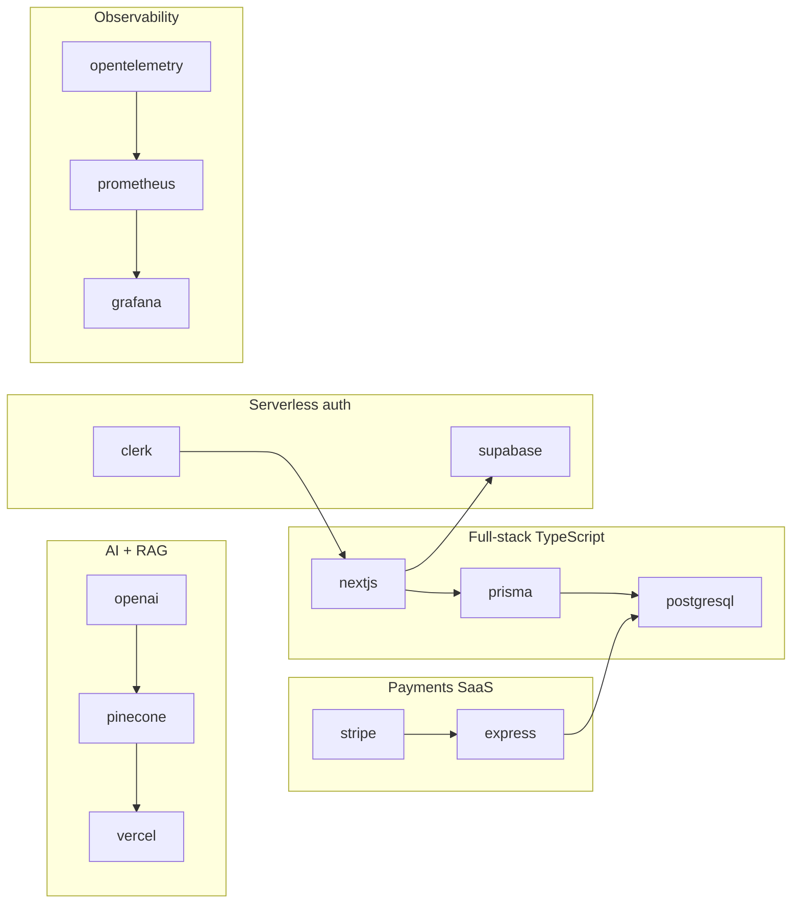
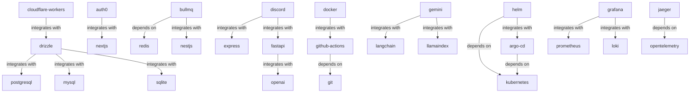

# Recommended stacks & relationships

The graph connects **100 skills** with **213 relationships** — prerequisites, alternatives, and stacks that work together.

## Popular stacks

- **Full-stack TypeScript:** [nextjs](/skills/nextjs) → [prisma](/skills/prisma) → [postgresql](/skills/postgresql)
- **Payments SaaS:** [stripe](/skills/stripe) → [express](/skills/express) → [postgresql](/skills/postgresql)
- **AI + RAG:** [openai](/skills/openai) → [pinecone](/skills/pinecone) → [vercel](/skills/vercel)
- **Serverless auth:** [clerk](/skills/clerk) → [nextjs](/skills/nextjs) → [supabase](/skills/supabase)
- **Observability:** [opentelemetry](/skills/opentelemetry) → [prometheus](/skills/prometheus) → [grafana](/skills/grafana)

## Stack diagram

## Prerequisites & integrations (sample)

## How to read edges

| Type | Meaning |
| :--- | :--- |
| `depends_on` | Install or learn this first |
| `integrates_with` | Commonly used together |
| `works_well_with` | Recommended pairing |
| `alternative_to` | Pick one or the other |
| `related_to` | Same domain, explore both |

## Learning paths

1. **Backend API** — `express` → `postgresql` → `prisma` → `stripe`
2. **Frontend app** — `react` → `nextjs` → `vercel`
3. **AI features** — `openai` → `langchain` → `pinecone`

Raw data: [`registry/graph.json`](https://github.com/ashish7802/awesome-api-skills/blob/master/registry/graph.json)
