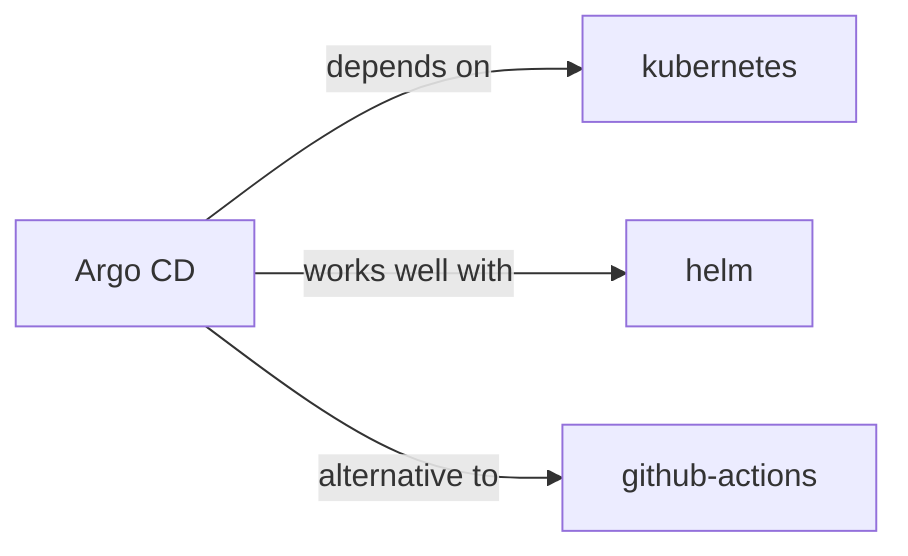

# argo-cd

<p class="skill-meta">CI/CD · Infrastructure</p>


<div class="trust-panel">
  <div class="trust-header">
    <div class="trust-badge">
      <span class="pulse-dot"></span>
      <span>validated</span>
    </div>
    <span class="trust-version">Schema v1.0.0</span>
  </div>
  <div class="trust-grid">
    <div class="trust-item">
      <span class="trust-label">Maintainer</span>
      <span class="trust-val">Awesome API Skills Team</span>
    </div>
    <div class="trust-item">
      <span class="trust-label">Last Verified</span>
      <span class="trust-val">2026-07-02</span>
    </div>
    <div class="trust-item">
      <span class="trust-label">Languages</span>
      <span class="trust-val">yaml</span>
    </div>
    <div class="trust-item">
      <span class="trust-label">Supported Agents</span>
      <span class="trust-val">cursor, claude-code, cline, continue</span>
    </div>
  </div>
  <div class="trust-doc-link"><a href="https://argo-cd.readthedocs.io/" target="_blank" rel="noopener">Official Documentation ↗</a></div>
</div>


## Graph

- **depends on** → [kubernetes](/skills/kubernetes)
- **works well with** → [helm](/skills/helm)
- **alternative to** → [github-actions](/skills/github-actions)

---


> Declarative continuous deployment for Kubernetes.

## Ecosystem Graph



## Quick Start
Argo CD implements GitOps. Instead of your CI pipeline pushing deployments to Kubernetes, Argo CD runs inside Kubernetes and continually pulls the latest desired state from your Git repository.

```bash
kubectl apply -n argocd -f https://raw.githubusercontent.com/argoproj/argo-cd/stable/manifests/install.yaml
```

## Production Patterns
### The App of Apps Pattern
Define a root Argo CD `Application` custom resource that points to a Git directory containing *other* `Application` resources. This allows Argo CD to bootstrap and manage an entire cluster's configuration recursively.

## Architecture & Scaling
### Self-Healing
Enable Auto-Sync and Self-Healing. If a developer manually runs `kubectl edit` in production to change a replica count, Argo CD will detect the configuration drift and immediately overwrite it, forcing Git to remain the single source of truth.

## Error Recovery
If an automated sync breaks the cluster, simply `git revert` the bad commit in your repository. Argo CD will instantly detect the rollback in Git and sync the cluster back to the healthy state.

## Security Notes
Argo CD requires extremely high privileges in the cluster. Ensure its UI/API is strictly protected via SSO (OIDC/SAML). Limit access using Argo CD's native RBAC to ensure developers can only sync applications in their specific namespaces.

## Relationships
**Prerequisites**: [kubernetes](/skills/kubernetes)

**Alternatives**: [github-actions](/skills/github-actions)

**Works Well With**: [helm](/skills/helm)

## References
- [Argo CD Docs](https://argo-cd.readthedocs.io/)

## Why use this skill
Use this when your agent works with **argo-cd** — structured patterns beat pasted docs and prevent common hallucinations.

## AI pitfalls
- Hardcoding region or account IDs
- Missing IAM least-privilege on cloud resources
- Confusing similar service names (e.g. S3 vs CloudFront)

## Production checklist
- [ ] Secrets in environment variables, not source code
- [ ] Error handling and logging in place
- [ ] Rate limits and timeouts configured

## Related skills
- [`kubernetes`](../kubernetes/SKILL.md) — depends on
- [`helm`](../helm/SKILL.md) — works well with
- [`github-actions`](../github-actions/SKILL.md) — alternative to

---
> **Last Verified:** 2026-07-02

