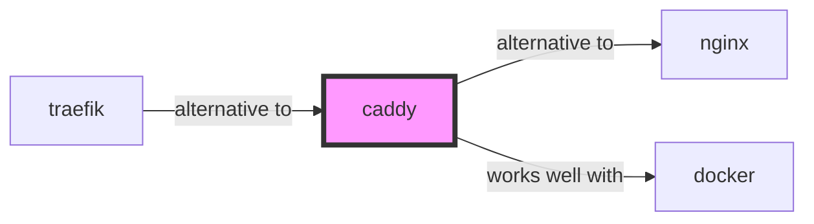

# caddy

<p class="skill-meta">Infrastructure · Security</p>


<div class="trust-panel">
  <div class="trust-header">
    <div class="trust-badge">
      <span class="pulse-dot"></span>
      <span>validated</span>
    </div>
    <span class="trust-version">Schema v1.0.0</span>
  </div>
  <div class="trust-grid">
    <div class="trust-item">
      <span class="trust-label">Maintainer</span>
      <span class="trust-val">Awesome API Skills Team</span>
    </div>
    <div class="trust-item">
      <span class="trust-label">Last Verified</span>
      <span class="trust-val">2026-07-02</span>
    </div>
    <div class="trust-item">
      <span class="trust-label">Languages</span>
      <span class="trust-val">yaml</span>
    </div>
    <div class="trust-item">
      <span class="trust-label">Supported Agents</span>
      <span class="trust-val">cursor, claude-code, cline, continue</span>
    </div>
  </div>
  <div class="trust-doc-link"><a href="https://caddyserver.com/docs/" target="_blank" rel="noopener">Official Documentation ↗</a></div>
</div>


## Graph

- **alternative to** → [nginx](/skills/nginx)
- **works well with** → [docker](/skills/docker)
- **alternative to** ← [traefik](/skills/traefik)

---


> The ultimate enterprise web server with automatic HTTPS.

## Ecosystem Graph Preview



## Recommended Next Skills

- **[traefik](/skills/traefik)** (Score: 0.99)
  *Why: Direct relationship, Both are Infrastructure, Shared ecosystem (devops), Can deploy to docker, Similar network profile, Logical next step*
- **[nginx](/skills/nginx)** (Score: 0.98)
  *Why: Direct relationship, Both are Infrastructure, Shared ecosystem (devops), Can deploy to docker, Similar network profile, Logical next step*
- **[docker](/skills/docker)** (Score: 0.87)
  *Why: Direct relationship, Both are Infrastructure, Shared ecosystem (devops), Similar network profile, Logical next step*

## Quick Start
Caddy is a modern Go-based web server that completely automates TLS certificate generation and renewal via Let's Encrypt.

```bash
caddy run
```

## Production Patterns
### Automatic HTTPS
Unlike NGINX where you must configure certbot and cron jobs manually, Caddy handles the entire ACME challenge, certificate generation, and auto-renewal internally without any configuration beyond defining your domain name.

## Architecture & Scaling
### Caddyfile
The configuration syntax is drastically simpler than NGINX. A fully functional reverse proxy with automatic HTTPS is literally two lines of code.

## Error Recovery
If Caddy fails to start due to port binding errors, ensure port 80 and 443 are free. Caddy MUST bind to port 80 to complete the HTTP-01 Let's Encrypt challenge.

## Security Notes
Caddy is memory-safe since it's written in Go, eliminating entire classes of buffer overflow vulnerabilities present in older C-based servers.

## References
- [Caddy Docs](https://caddyserver.com/docs/)

## Why use this skill
Use this when your agent works with **caddy** — structured patterns beat pasted docs and prevent common hallucinations.

## AI pitfalls
- Hardcoding region or account IDs
- Missing IAM least-privilege on cloud resources
- Confusing similar service names (e.g. S3 vs CloudFront)

## Production checklist
- [ ] Secrets in environment variables, not source code
- [ ] Error handling and logging in place
- [ ] Rate limits and timeouts configured

## Related skills
- [`nginx`](../nginx/SKILL.md) — alternative to
- [`docker`](../docker/SKILL.md) — works well with

---
> **Last Verified:** 2026-07-02

