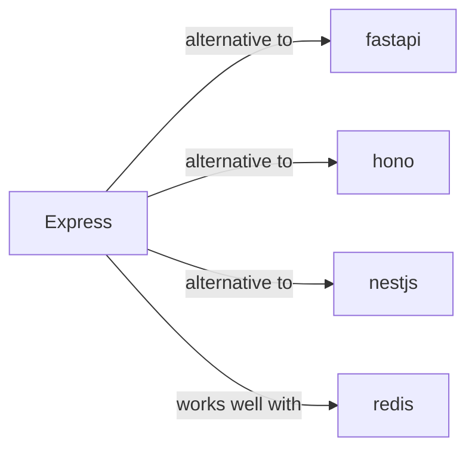

# express

<p class="skill-meta">Backend Frameworks</p>


<div class="trust-panel">

| | |
| :--- | :--- |
| **Validation** | validated |
| **Schema** | 1.0.0 |
| **Maintainer** | Awesome API Skills Team |
| **Updated** | 2026-07-02 |
| **Languages** | typescript |
| **Agents** | cursor, claude-code, cline, continue |
| **Doc source** | [official docs](https://expressjs.com/) |

</div>


## Graph

- **alternative to** → [fastapi](/skills/fastapi)
- **alternative to** → [hono](/skills/hono)
- **alternative to** → [nestjs](/skills/nestjs)
- **works well with** → [redis](/skills/redis)
- **integrates with** ← [discord](/skills/discord)
- **monitors** ← [sentry](/skills/sentry)

---

# Express Skill

> Fast, unopinionated, minimalist web framework for Node.js.

## Ecosystem Graph



## Quick Start
Express is the most mature Node.js HTTP framework. It utilizes a simple middleware chain architecture.

```bash
npm install express cors
```

## Production Patterns
### Controller Pattern
Do not write massive anonymous functions inside your `app.get()` routes. Extract business logic into dedicated controller files (e.g., `user.controller.js`) and pass them to the Express router.

## Architecture & Scaling
### Middleware Chains
Express executes middleware sequentially. Always ensure your JSON body parser (`express.json()`) is registered *before* the routes that need to read `req.body`. Ensure you call `next()` to pass control.

## Error Recovery
Express 4 does not automatically catch asynchronous errors. You must wrap your async route handlers in a `try/catch` block and pass the error to `next(err)`. (Note: Express 5 changes this behavior). Always register a global error handler at the very bottom of your middleware chain.

## Security Notes
Install and configure `helmet` to automatically set secure HTTP headers. Rate limit endpoints using `express-rate-limit` backed by Redis to prevent brute-force attacks.

## Relationships
**Alternatives**: [fastapi](/skills/fastapi), [hono](/skills/hono), [nestjs](/skills/nestjs)

**Works Well With**: [redis](/skills/redis)

## References
- [Express Docs](https://expressjs.com/)

## Why use this skill
Use this when your agent works with **express** — structured patterns beat pasted docs and prevent common hallucinations.

## AI pitfalls
- Using outdated SDK or API versions from training data
- Inventing environment variable names
- Omitting error handling and retry logic

## Production checklist
- [ ] Secrets in environment variables, not source code
- [ ] Error handling and logging in place
- [ ] Rate limits and timeouts configured

## Related skills
- [`fastapi`](../fastapi/SKILL.md) — alternative to
- [`hono`](../hono/SKILL.md) — alternative to
- [`nestjs`](../nestjs/SKILL.md) — alternative to
- [`redis`](../redis/SKILL.md) — works well with

---
> **Last Verified:** 2026-07-02

