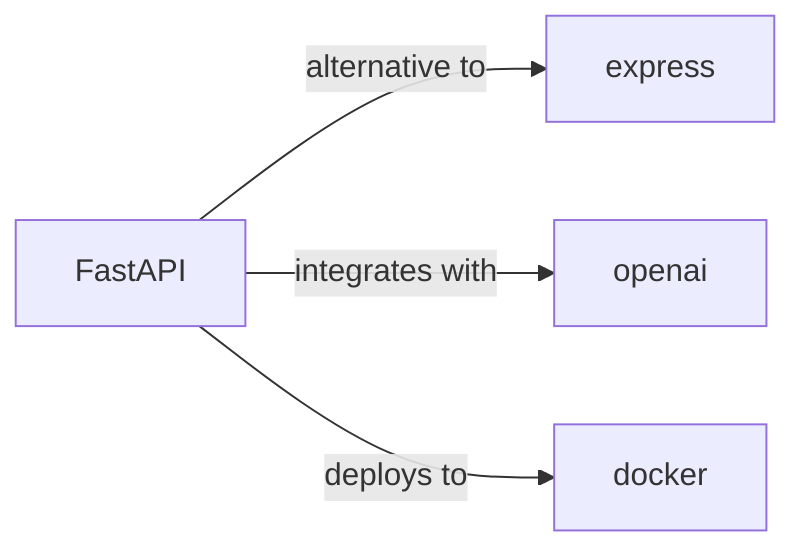

# fastapi

<p class="skill-meta">Backend Frameworks</p>


<div class="trust-panel">

| | |
| :--- | :--- |
| **Validation** | validated |
| **Schema** | 1.0.0 |
| **Maintainer** | Awesome API Skills Team |
| **Updated** | 2026-07-02 |
| **Languages** | python |
| **Agents** | cursor, claude-code, cline, continue |
| **Doc source** | [official docs](https://fastapi.tiangolo.com/) |

</div>


## Graph

- **alternative to** → [express](/skills/express)
- **integrates with** → [openai](/skills/openai)
- **deploys to** → [docker](/skills/docker)

---

# FastAPI Skill

> High-performance Python web framework.

## Ecosystem Graph



## Quick Start
FastAPI leverages Python type hints to generate OpenAPI documentation automatically and serialize data incredibly fast using Pydantic.

```bash
pip install fastapi uvicorn pydantic
```

## Production Patterns
### Dependency Injection
Use the `Depends()` feature heavily. Inject database sessions, authenticators, and external clients directly into your route functions rather than relying on global state. This makes unit testing trivial by overriding dependencies.

## Architecture & Scaling
### Async vs Sync
FastAPI handles both `def` and `async def` routes. If you are using a synchronous database driver (like `psycopg2`), declare the route as `def` so FastAPI runs it in an external threadpool. If using an asynchronous driver (like `asyncpg`), use `async def`.

## Error Recovery
Raise `HTTPException` inside your routes for expected errors (e.g., 404). For unexpected global errors, register a global exception handler via `@app.exception_handler` to sanitize the error response and log the stack trace to Sentry.

## Security Notes
Use `OAuth2PasswordBearer` for built-in token extraction. Never expose raw SQL queries; always use an ORM like SQLAlchemy or SQLModel to prevent SQL injection.

## Relationships
**Alternatives**: [express](/skills/express)

**Works Well With**: [openai](/skills/openai)

**Deploys To**: [docker](/skills/docker)

## References
- [FastAPI Docs](https://fastapi.tiangolo.com/)

## Why use this skill
Use this when your agent works with **fastapi** — structured patterns beat pasted docs and prevent common hallucinations.

## AI pitfalls
- Using outdated SDK or API versions from training data
- Inventing environment variable names
- Omitting error handling and retry logic

## Production checklist
- [ ] Secrets in environment variables, not source code
- [ ] Error handling and logging in place
- [ ] Rate limits and timeouts configured

## Related skills
- [`express`](../express/SKILL.md) — alternative to
- [`openai`](../openai/SKILL.md) — integrates with
- [`docker`](../docker/SKILL.md) — deploys to

---
> **Last Verified:** 2026-07-02

