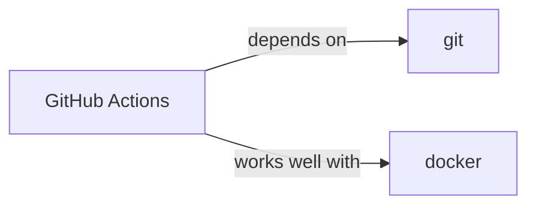

# github-actions

<p class="skill-meta">CI/CD · Developer Tools</p>


<div class="trust-panel">

| | |
| :--- | :--- |
| **Validation** | validated |
| **Schema** | 1.0.0 |
| **Maintainer** | Awesome API Skills Team |
| **Updated** | 2026-06-29 |
| **Languages** | yaml |
| **Agents** | cursor, claude-code, cline, continue |
| **Doc source** | [official docs](https://docs.github.com/en/actions) |

</div>


## Graph

- **depends on** → [git](/skills/git)
- **works well with** → [docker](/skills/docker)
- **alternative to** ← [argo-cd](/skills/argo-cd)
- **works well with** ← [openid-connect](/skills/openid-connect)
- **integrates with** ← [playwright](/skills/playwright)
- **integrates with** ← [slack](/skills/slack)
- **integrates with** ← [terraform](/skills/terraform)
- **integrates with** ← [turborepo](/skills/turborepo)

---

# GitHub Actions Skill

> Automate your software workflows directly from GitHub.

## Ecosystem Graph



## Quick Start
GitHub Actions uses YAML workflows defined in `.github/workflows/` to automatically run tests, build images, and deploy code upon pushes or pull requests.

```yaml
on: [push]
jobs:
  build:
    runs-on: ubuntu-latest
```

## Production Patterns
### Reusable Workflows
Do not duplicate CI steps across 50 repositories. Create a centralized repository containing reusable workflows (`workflow_call`), and have individual repositories reference them. This allows updating CI standards globally.

## Architecture & Scaling
### Dependency Caching
Always cache `node_modules` or `~/.cache/pip` using the `actions/cache` action or built-in caching via `actions/setup-node`. This can reduce CI pipeline times by 50% or more.

## Error Recovery
If a flaky test fails the pipeline, you can use the `continue-on-error: true` flag for that specific step, though it is highly recommended to fix the test rather than masking it.

## Security Notes
Never use `pull_request_target` unless absolutely necessary, as it grants actions access to repository secrets even from forked PRs, leading to easy secret exfiltration attacks. Use OpenID Connect (OIDC) instead of storing long-lived AWS/GCP credentials in GitHub Secrets.

## Relationships
**Prerequisites**: [git](/skills/git)

**Works Well With**: [docker](/skills/docker)

## References
- [GitHub Actions](https://docs.github.com/en/actions)

## Why use this skill
Use this when your agent works with **github-actions** — structured patterns beat pasted docs and prevent common hallucinations.

## AI pitfalls
- Referencing CLI flags or config keys that do not exist
- Using outdated major versions of tools
- Skipping lockfile or version pinning in examples

## Production checklist
- [ ] Secrets in environment variables, not source code
- [ ] Error handling and logging in place
- [ ] Rate limits and timeouts configured

## Related skills
- [`git`](../git/SKILL.md) — depends on
- [`docker`](../docker/SKILL.md) — works well with

