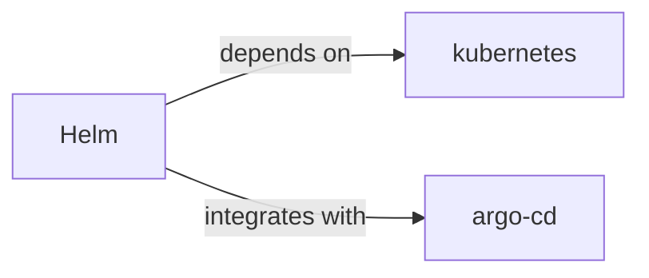

# helm

<p class="skill-meta">Developer Tools · Infrastructure</p>


<div class="trust-panel">
  <div class="trust-header">
    <div class="trust-badge">
      <span class="pulse-dot"></span>
      <span>validated</span>
    </div>
    <span class="trust-version">Schema v1.0.0</span>
  </div>
  <div class="trust-grid">
    <div class="trust-item">
      <span class="trust-label">Maintainer</span>
      <span class="trust-val">Awesome API Skills Team</span>
    </div>
    <div class="trust-item">
      <span class="trust-label">Last Verified</span>
      <span class="trust-val">2026-07-02</span>
    </div>
    <div class="trust-item">
      <span class="trust-label">Languages</span>
      <span class="trust-val">yaml</span>
    </div>
    <div class="trust-item">
      <span class="trust-label">Supported Agents</span>
      <span class="trust-val">cursor, claude-code, cline, continue</span>
    </div>
  </div>
  <div class="trust-doc-link"><a href="https://helm.sh/docs/" target="_blank" rel="noopener">Official Documentation ↗</a></div>
</div>


## Graph

- **depends on** → [kubernetes](/skills/kubernetes)
- **integrates with** → [argo-cd](/skills/argo-cd)

---


> The package manager for Kubernetes.

## Ecosystem Graph



## Quick Start
Helm packages Kubernetes YAML files into distributable 'Charts'. It allows templating YAML files so you can deploy identical apps to staging and production with different environment variables.

```bash
helm install my-release bitnami/redis
```

## Production Patterns
### Umbrella Charts
For complex microservice architectures, create an 'Umbrella' Helm chart that contains no templates of its own, but defines your individual microservice charts as dependencies in `Chart.yaml`. This allows deploying your entire ecosystem with a single command.

## Architecture & Scaling
### Values Overrides
Keep your chart templates generic. Define environment-specific configurations entirely within `values-staging.yaml` and `values-prod.yaml`. Pass these during installation: `helm upgrade -f values-prod.yaml ...`

## Error Recovery
Use `helm rollback <release> <revision>` to instantly revert a broken deployment. Helm tracks the history of deployed charts natively in Kubernetes Secrets.

## Security Notes
Do not store plaintext passwords in `values.yaml` files committed to Git. Use tools like HashiCorp Vault or `helm-secrets` (backed by SOPS) to inject encrypted values at deploy time.

## Relationships
**Prerequisites**: [kubernetes](/skills/kubernetes)

**Works Well With**: [argo-cd](/skills/argo-cd)

## References
- [Helm Docs](https://helm.sh/docs/)

## Why use this skill
Use this when your agent works with **helm** — structured patterns beat pasted docs and prevent common hallucinations.

## AI pitfalls
- Referencing CLI flags or config keys that do not exist
- Using outdated major versions of tools
- Skipping lockfile or version pinning in examples

## Production checklist
- [ ] Secrets in environment variables, not source code
- [ ] Error handling and logging in place
- [ ] Rate limits and timeouts configured

## Related skills
- [`kubernetes`](../kubernetes/SKILL.md) — depends on
- [`argo-cd`](../argo-cd/SKILL.md) — integrates with

---
> **Last Verified:** 2026-07-02

