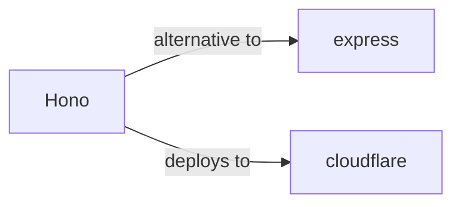

# hono

<p class="skill-meta">Backend Frameworks</p>


<div class="trust-panel">
  <div class="trust-header">
    <div class="trust-badge">
      <span class="pulse-dot"></span>
      <span>validated</span>
    </div>
    <span class="trust-version">Schema v1.0.0</span>
  </div>
  <div class="trust-grid">
    <div class="trust-item">
      <span class="trust-label">Maintainer</span>
      <span class="trust-val">Awesome API Skills Team</span>
    </div>
    <div class="trust-item">
      <span class="trust-label">Last Verified</span>
      <span class="trust-val">2026-07-02</span>
    </div>
    <div class="trust-item">
      <span class="trust-label">Languages</span>
      <span class="trust-val">typescript</span>
    </div>
    <div class="trust-item">
      <span class="trust-label">Supported Agents</span>
      <span class="trust-val">cursor, claude-code, cline, continue</span>
    </div>
  </div>
  <div class="trust-doc-link"><a href="https://hono.dev/" target="_blank" rel="noopener">Official Documentation ↗</a></div>
</div>


## Graph

- **alternative to** → [express](/skills/express)
- **deploys to** → [cloudflare](/skills/cloudflare)
- **works well with** ← [cloudflare-workers](/skills/cloudflare-workers)
- **works well with** ← [deno-deploy](/skills/deno-deploy)
- **works well with** ← [unkey](/skills/unkey)

---


> Ultrafast web framework for the Edges.

## Ecosystem Graph



## Quick Start
Hono is designed specifically for Edge Runtimes (Cloudflare Workers, Deno, Bun, Fastly). It utilizes the standard Web Fetch API rather than Node.js specific APIs.

```bash
npm create hono@latest
```

## Production Patterns
### RPC (Remote Procedure Call)
Hono provides `hono/rpc` which allows you to share your backend route types with your frontend, enabling end-to-end type safety without generating OpenAPI schemas.

## Architecture & Scaling
### Web Standard APIs
Hono strictly uses the Web Standard `Request` and `Response` objects. You cannot use Node.js `res.send()` or `req.body`. Instead, you use `c.json()` and `await c.req.json()`.

## Error Recovery
Use `app.onError` to catch exceptions globally. Since Edge functions often fail due to network timeouts when communicating with external databases, implement retry mechanisms using libraries designed for the Web Fetch API.

## Security Notes
Hono includes built-in middleware for CSRF, CORS, and Basic Auth. When deploying to Cloudflare Workers, environment variables (secrets) are accessed via `c.env` rather than `process.env`.

## Relationships
**Alternatives**: [express](/skills/express)

**Deploys To**: [cloudflare](/skills/cloudflare)

## References
- [Hono Docs](https://hono.dev/)

## Why use this skill
Use this when your agent works with **hono** — structured patterns beat pasted docs and prevent common hallucinations.

## AI pitfalls
- Using outdated SDK or API versions from training data
- Inventing environment variable names
- Omitting error handling and retry logic

## Production checklist
- [ ] Secrets in environment variables, not source code
- [ ] Error handling and logging in place
- [ ] Rate limits and timeouts configured

## Related skills
- [`express`](../express/SKILL.md) — alternative to
- [`cloudflare`](../cloudflare/SKILL.md) — deploys to

---
> **Last Verified:** 2026-07-02

