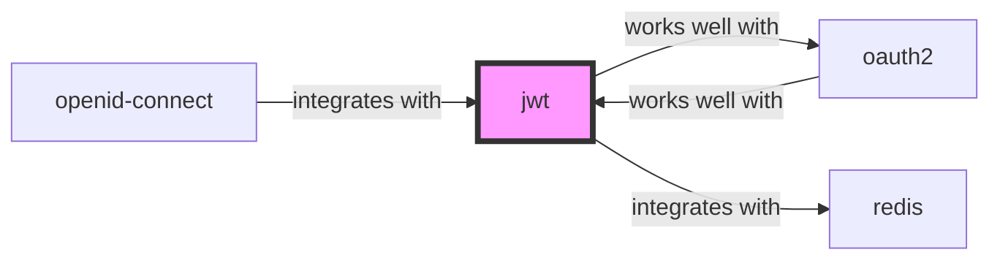

# jwt

<p class="skill-meta">Authentication · Security</p>


<div class="trust-panel">

| | |
| :--- | :--- |
| **Validation** | validated |
| **Schema** | 1.0.0 |
| **Maintainer** | Awesome API Skills Team |
| **Updated** | 2026-07-02 |
| **Languages** | typescript |
| **Agents** | cursor, claude-code, cline, continue |
| **Doc source** | [official docs](https://jwt.io/) |

</div>


## Graph

- **works well with** → [oauth2](/skills/oauth2)
- **integrates with** → [redis](/skills/redis)

---

# JSON Web Tokens Skill

> Compact, URL-safe means of representing claims to be transferred between two parties.

## Ecosystem Graph Preview



## Recommended Next Skills

- **[oauth2](/skills/oauth2)** (Score: 0.92)
  *Why: Direct relationship, Both are Authentication, Shared ecosystem (security), Can deploy to any, Similar network profile*
- **[openid-connect](/skills/openid-connect)** (Score: 0.92)
  *Why: Direct relationship, Both are Authentication, Shared ecosystem (security), Can deploy to any, Similar network profile*
- **[redis](/skills/redis)** (Score: 0.5)
  *Why: Direct relationship*

## Quick Start
JWTs allow you to cryptographically sign a JSON payload (claims). The backend can verify this signature locally without needing to query a database for every API request.

```bash
npm install jsonwebtoken
```

## Production Patterns
### The Invalidation Problem
Because JWTs are stateless and verified locally, you cannot instantly revoke a stolen JWT before it expires. Keep expiration times (`exp`) extremely short (e.g., 15 minutes) and issue long-lived Refresh Tokens that are checked against the database.

## Architecture & Scaling
### Header, Payload, Signature
A JWT is simply Base64Url encoded. The payload is NOT encrypted. Anyone who intercepts the token can read the data. Do not store sensitive information (like SSNs or passwords) inside the JWT payload.

## Error Recovery
Always wrap `jwt.verify()` in a try/catch block. It will throw specific errors for `TokenExpiredError` and `JsonWebTokenError` (invalid signature), which should map to a 401 HTTP response.

## Security Notes
Never accept tokens where the algorithm (`alg`) is set to `none`. Attackers use this to bypass signature verification. Always explicitly define the allowed algorithms in your verification function.

## References
- [JWT.io](https://jwt.io/)

## Why use this skill
Use this when your agent works with **jwt** — structured patterns beat pasted docs and prevent common hallucinations.

## AI pitfalls
- Using outdated SDK or API versions from training data
- Inventing environment variable names
- Omitting error handling and retry logic

## Production checklist
- [ ] Secrets in environment variables, not source code
- [ ] Error handling and logging in place
- [ ] Rate limits and timeouts configured

## Related skills
- [`oauth2`](../oauth2/SKILL.md) — works well with
- [`redis`](../redis/SKILL.md) — integrates with

---
> **Last Verified:** 2026-07-02

