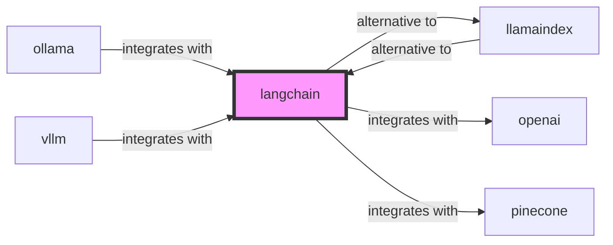

# langchain

<p class="skill-meta">AI · Developer Tools</p>


<div class="trust-panel">
  <div class="trust-header">
    <div class="trust-badge">
      <span class="pulse-dot"></span>
      <span>validated</span>
    </div>
    <span class="trust-version">Schema v1.0.0</span>
  </div>
  <div class="trust-grid">
    <div class="trust-item">
      <span class="trust-label">Maintainer</span>
      <span class="trust-val">Awesome API Skills Team</span>
    </div>
    <div class="trust-item">
      <span class="trust-label">Last Verified</span>
      <span class="trust-val">2026-07-02</span>
    </div>
    <div class="trust-item">
      <span class="trust-label">Languages</span>
      <span class="trust-val">python</span>
    </div>
    <div class="trust-item">
      <span class="trust-label">Supported Agents</span>
      <span class="trust-val">cursor, claude-code, cline, continue</span>
    </div>
  </div>
  <div class="trust-doc-link"><a href="https://python.langchain.com/docs/get_started/introduction" target="_blank" rel="noopener">Official Documentation ↗</a></div>
</div>


## Graph

- **alternative to** → [llamaindex](/skills/llamaindex)
- **integrates with** → [openai](/skills/openai)
- **integrates with** → [pinecone](/skills/pinecone)
- **integrates with** ← [gemini](/skills/gemini)
- **integrates with** ← [ollama](/skills/ollama)
- **integrates with** ← [vllm](/skills/vllm)
- **integrates with** ← [qdrant](/skills/qdrant)
- **integrates with** ← [deepseek](/skills/deepseek)

---


> Framework for developing applications powered by language models.

## Ecosystem Graph Preview



## Recommended Next Skills

- **[llamaindex](/skills/llamaindex)** (Score: 0.93)
  *Why: Direct relationship, Both are AI, Shared ecosystem (ai), Can deploy to any, Similar network profile*
- **[ollama](/skills/ollama)** (Score: 0.83)
  *Why: Direct relationship, Both are AI, Shared ecosystem (ai), Similar network profile*
- **[vllm](/skills/vllm)** (Score: 0.82)
  *Why: Direct relationship, Both are AI, Shared ecosystem (ai), Similar network profile*

## Quick Start
LangChain provides standard interfaces for LLMs, Vector Stores, and Memory, allowing you to chain them together to build complex Agents and Retrieval-Augmented Generation (RAG) pipelines.

```bash
pip install langchain langchain-openai
```

## Production Patterns
### LCEL (LangChain Expression Language)
Avoid using massive legacy chain classes (like `ConversationalRetrievalChain`). Migrate entirely to LCEL, which uses Python pipe operators (`|`) to compose prompts, models, and output parsers declaratively. It automatically handles streaming and async logic.

## Architecture & Scaling
### Agents vs Chains
A Chain is a deterministic sequence of operations. An Agent utilizes an LLM's reasoning to dynamically determine which Tools to execute and in what order to solve a complex goal.

## Error Recovery
LLMs frequently output invalid JSON when asked for structured data. Use LangChain's `OutputFixingParser` which automatically catches parsing errors and feeds the broken output back to the LLM with instructions to fix it.

## Security Notes
Never give an Agent unmitigated access to destructive Tools (e.g., SQL DELETE capabilities or Shell execution). Always enforce human-in-the-loop approval or strict sandbox environments.

## References
- [LangChain Docs](https://python.langchain.com/docs/get_started/introduction)

## Why use this skill
Use this when your agent works with **langchain** — structured patterns beat pasted docs and prevent common hallucinations.

## AI pitfalls
- Using deprecated model IDs or wrong API endpoints
- Confusing chat vs completions vs embeddings APIs
- Omitting rate-limit and token budget handling

## Production checklist
- [ ] Secrets in environment variables, not source code
- [ ] Error handling and logging in place
- [ ] Rate limits and timeouts configured

## Related skills
- [`llamaindex`](../llamaindex/SKILL.md) — alternative to
- [`openai`](../openai/SKILL.md) — integrates with
- [`pinecone`](../pinecone/SKILL.md) — integrates with

---
> **Last Verified:** 2026-07-02

