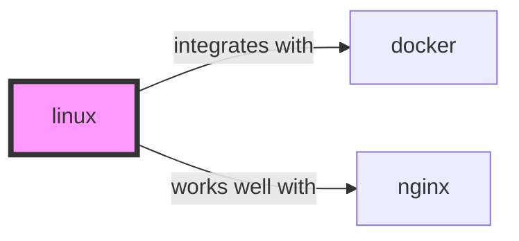

# linux

Infrastructure · Enterprise

  

    

      
      validated
    

    Schema v1.0.0
  

  

    

      Maintainer
      Awesome API Skills Team
    

    

      Last Verified
      2026-07-02
    

    

      Languages
      bash
    

    

      Supported Agents
      cursor, claude-code, cline, continue
    

  

  
<a href="https://www.kernel.org/doc/html/latest/" target="_blank" rel="noopener">Official Documentation ↗</a>

## Graph

- **integrates with** → [docker](/skills/docker)
- **works well with** → [nginx](/skills/nginx)

---

> The free, open-source operating system that powers the internet.

## Ecosystem Graph Preview

## Recommended Next Skills

- **[nginx](/skills/nginx)** (Score: 0.82)
  *Why: Direct relationship, Both are Infrastructure, Shared ecosystem (devops), Similar network profile*
- **[docker](/skills/docker)** (Score: 0.81)
  *Why: Direct relationship, Both are Infrastructure, Shared ecosystem (devops), Similar network profile*
- **[kubernetes](/skills/kubernetes)** (Score: 0.43)
  *Why: Both are Infrastructure, Shared ecosystem (devops), Can deploy to aws, Similar network profile*

## Quick Start
Linux is the foundation of modern cloud computing. Understanding the kernel, filesystem hierarchy, and shell commands is required for debugging production outages.

## Production Patterns
### systemd
For background services running directly on a VM (like an NGINX proxy or a Go binary), do not run them in a `tmux` session. Write a `systemd` service file to ensure the process starts on boot and automatically restarts on failure.

## Architecture & Scaling
### Everything is a file
In Linux, configuration, hardware devices (`/dev/sda`), and kernel parameters (`/proc/sys`) are represented as files. You can often read from or write to these files directly to monitor or alter system state.

## Error Recovery
When a server runs out of disk space (`No space left on device`), but `df -h` shows space available, you have likely run out of inodes. Check `df -i`. This happens when you have millions of tiny files (like session files or log chunks).

## Security Notes
Disable SSH password authentication (`PasswordAuthentication no`) in `/etc/ssh/sshd_config`. Exclusively use Ed25519 SSH keys. Use `fail2ban` to automatically block IPs that repeatedly fail authentication.

## References
- [Linux Docs](https://www.kernel.org/doc/html/latest/)

## Why use this skill
Use this when your agent works with **linux** — structured patterns beat pasted docs and prevent common hallucinations.

## AI pitfalls
- Hardcoding region or account IDs
- Missing IAM least-privilege on cloud resources
- Confusing similar service names (e.g. S3 vs CloudFront)

## Production checklist
- [ ] Secrets in environment variables, not source code
- [ ] Error handling and logging in place
- [ ] Rate limits and timeouts configured

## Related skills
- [`docker`](../docker/SKILL.md) — integrates with
- [`nginx`](../nginx/SKILL.md) — works well with

---
> **Last Verified:** 2026-07-02

