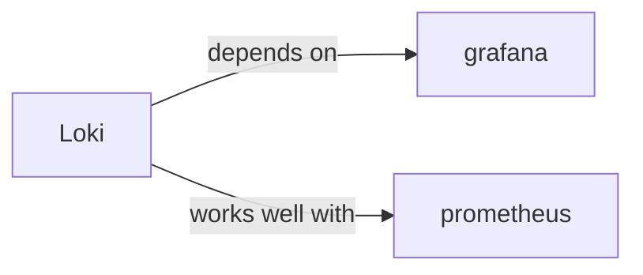

# loki

<p class="skill-meta">Observability</p>


<div class="trust-panel">

| | |
| :--- | :--- |
| **Validation** | validated |
| **Schema** | 1.0.0 |
| **Maintainer** | Awesome API Skills Team |
| **Updated** | 2026-07-02 |
| **Languages** | yaml |
| **Agents** | cursor, claude-code, cline, continue |
| **Doc source** | [official docs](https://grafana.com/docs/loki/latest/) |

</div>


## Graph

- **depends on** → [grafana](/skills/grafana)
- **works well with** → [prometheus](/skills/prometheus)

---

# Loki Skill

> Like Prometheus, but for logs.

## Ecosystem Graph



## Quick Start
Loki aggregates logs but, unlike Elasticsearch, it only indexes metadata labels rather than the full text of the log. This makes it insanely cheap and fast to operate.

```bash
docker run -d -p 3100:3100 grafana/loki
```

## Production Patterns
### LogQL vs Full Text
Do not expect to do complex full-text fuzzy searching natively. Loki forces you to filter by labels first (e.g., `{app="backend", env="prod"}`), and then it aggressively scans the chunks of text that match those labels.

## Architecture & Scaling
### Promtail
Loki requires an agent to ship logs. Promtail is the official agent. Deploy Promtail as a DaemonSet in Kubernetes to automatically scrape all pod stdout logs and forward them to the centralized Loki instance.

## Error Recovery
Loki will actively reject logs if they are sent out of chronological order (a common issue in highly distributed systems). Ensure you configure `unordered_writes: true` in your Loki configuration to mitigate this.

## Security Notes
Do not inject dynamic, unbounded user data (like session IDs or IPs) as Loki Labels. This causes Cardinality explosions, crashing the system. Log the dynamic data in the text payload, and only label static data (app name, region, environment).

## Relationships
**Prerequisites**: [grafana](/skills/grafana)

**Works Well With**: [prometheus](/skills/prometheus)

## References
- [Loki Docs](https://grafana.com/docs/loki/latest/)

## Why use this skill
Use this when your agent works with **loki** — structured patterns beat pasted docs and prevent common hallucinations.

## AI pitfalls
- Using outdated SDK or API versions from training data
- Inventing environment variable names
- Omitting error handling and retry logic

## Production checklist
- [ ] Secrets in environment variables, not source code
- [ ] Error handling and logging in place
- [ ] Rate limits and timeouts configured

## Related skills
- [`grafana`](../grafana/SKILL.md) — depends on
- [`prometheus`](../prometheus/SKILL.md) — works well with

---
> **Last Verified:** 2026-07-02

