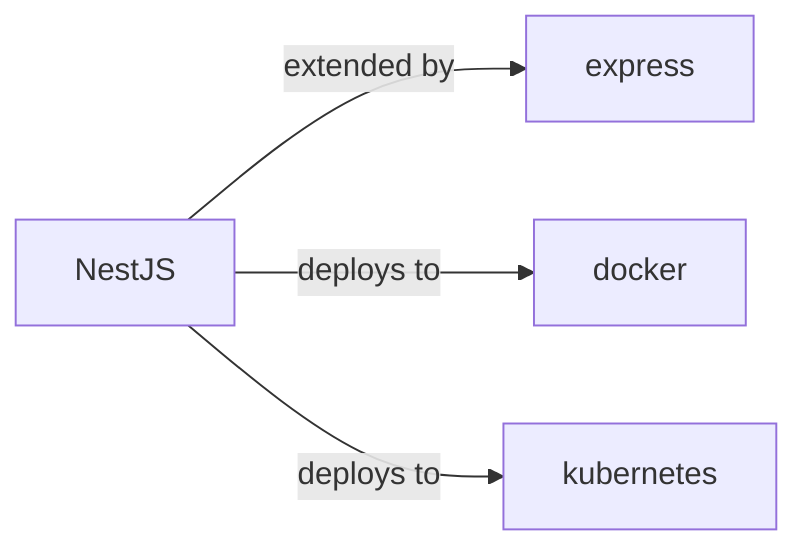

# nestjs

<p class="skill-meta">Backend Frameworks</p>


<div class="trust-panel">

| | |
| :--- | :--- |
| **Validation** | validated |
| **Schema** | 1.0.0 |
| **Maintainer** | Awesome API Skills Team |
| **Updated** | 2026-07-02 |
| **Languages** | typescript |
| **Agents** | cursor, claude-code, cline, continue |
| **Doc source** | [official docs](https://docs.nestjs.com/) |

</div>


## Graph

- **extended by** → [express](/skills/express)
- **deploys to** → [docker](/skills/docker)
- **deploys to** → [kubernetes](/skills/kubernetes)
- **integrates with** ← [bullmq](/skills/bullmq)

---

# NestJS Skill

> A progressive Node.js framework for building efficient, reliable and scalable server-side applications.

## Ecosystem Graph



## Quick Start
NestJS forces an Angular-like architecture (Modules, Controllers, Providers) onto Node.js. Under the hood, it uses Express by default but can be swapped to Fastify.

```bash
npm i -g @nestjs/cli
nest new project-name
```

## Production Patterns
### Dependency Injection
Never instantiate classes with `new`. Use the `@Injectable()` decorator and let the Nest IoC (Inversion of Control) container manage singletons. This makes mocking services during testing exceptionally easy.

## Architecture & Scaling
### Microservices
Nest natively supports microservice architectures. Instead of HTTP, you can easily configure a controller to listen to Kafka, NATS, or Redis Pub/Sub using the `@MessagePattern()` decorator without changing your business logic.

## Error Recovery
Use custom Exception Filters (`@Catch()`) to map domain-specific errors (like database connection failures) to standard HTTP responses globally.

## Security Notes
Utilize NestJS Guards (`@Injectable() implements CanActivate`) to handle Authorization (e.g., verifying JWTs or Role-Based Access Control). Guards execute before interceptors and pipes.

## Relationships
**Deploys To**: [docker](/skills/docker), [kubernetes](/skills/kubernetes)

## References
- [NestJS Docs](https://docs.nestjs.com/)

## Why use this skill
Use this when your agent works with **nestjs** — structured patterns beat pasted docs and prevent common hallucinations.

## AI pitfalls
- Using outdated SDK or API versions from training data
- Inventing environment variable names
- Omitting error handling and retry logic

## Production checklist
- [ ] Secrets in environment variables, not source code
- [ ] Error handling and logging in place
- [ ] Rate limits and timeouts configured

## Related skills
- [`express`](../express/SKILL.md) — extended by
- [`docker`](../docker/SKILL.md) — deploys to
- [`kubernetes`](../kubernetes/SKILL.md) — deploys to

---
> **Last Verified:** 2026-07-02

