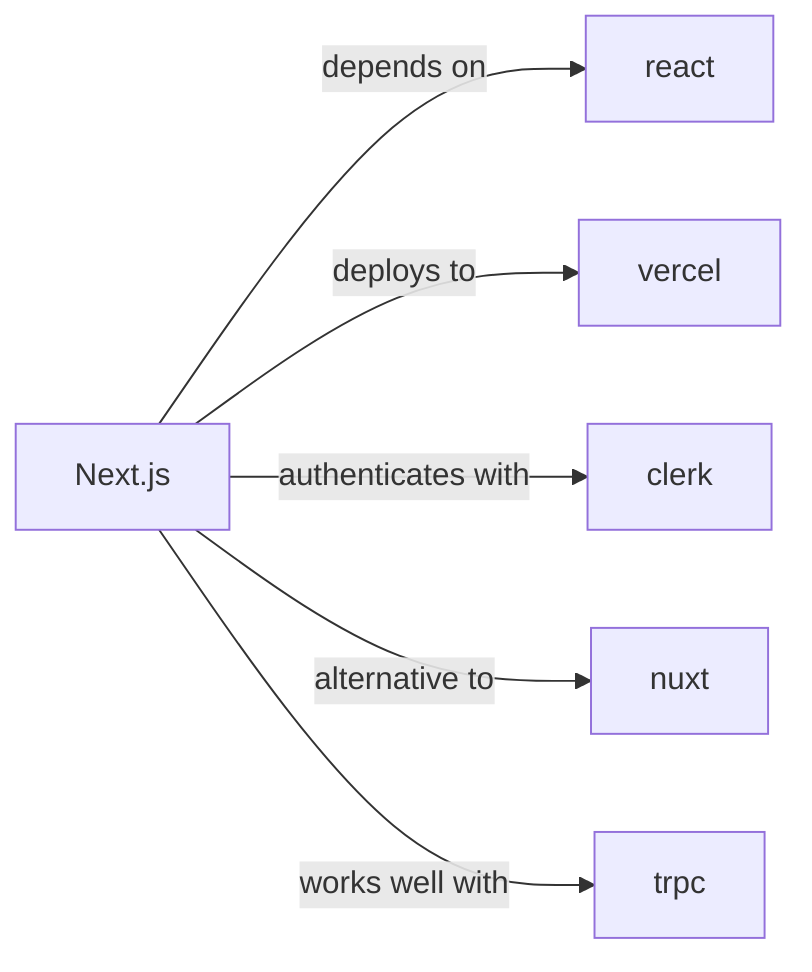

# nextjs

<p class="skill-meta">Frontend Frameworks</p>


<div class="trust-panel">

| | |
| :--- | :--- |
| **Validation** | validated |
| **Schema** | 1.0.0 |
| **Maintainer** | Awesome API Skills Team |
| **Updated** | 2026-06-29 |
| **Languages** | typescript, python, go |
| **Agents** | cursor, claude-code, cline, continue |
| **Doc source** | [official docs](https://nextjs.org/docs) |

</div>


## Graph

- **depends on** → [react](/skills/react)
- **deploys to** → [vercel](/skills/vercel)
- **authenticates with** → [clerk](/skills/clerk)
- **alternative to** → [nuxt](/skills/nuxt)
- **works well with** → [trpc](/skills/trpc)
- **integrates with** ← [auth0](/skills/auth0)
- **works well with** ← [eslint](/skills/eslint)
- **works well with** ← [playwright](/skills/playwright)

---

# Next.js Skill

> The React Framework for the Web.

## Ecosystem Graph



## Quick Start
Next.js 14+ emphasizes the App Router and React Server Components. Server Components execute exclusively on the server, drastically reducing client-side JavaScript bundles.

```bash
npx create-next-app@latest
```

## Production Patterns
### Cache Invalidation
The App Router aggressively caches data. Do not rely on time-based revalidation (`revalidate: 60`) for highly dynamic, user-specific data. Instead, use On-Demand Revalidation (`revalidateTag` or `revalidatePath`) triggered directly from your Server Actions after a database mutation.

## Architecture & Scaling
### Edge vs Node.js Runtimes
Next.js allows specifying `export const runtime = 'edge'` on a per-route basis. The Edge runtime boots in milliseconds but strictly prohibits native Node.js APIs (like `fs` or `crypto`). For heavy backend processing, stick to the default Node.js runtime.

## Error Recovery
Use `error.tsx` at the segment level to catch unexpected runtime errors in Server Components. For expected validation errors during form submissions, return strongly-typed error objects from your Server Action rather than throwing exceptions.

## Security Notes
Never expose environment variables to the browser unless they are strictly prefixed with `NEXT_PUBLIC_`. Treat Server Actions exactly like public API endpoints; always verify the user session (e.g., via Clerk `auth()`) inside the action before mutating data.

## Relationships
**Prerequisites**: [react](/skills/react)

**Alternatives**: [nuxt](/skills/nuxt)

**Works Well With**: [trpc](/skills/trpc)

**Deploys To**: [vercel](/skills/vercel)

## References
- [App Router Docs](https://nextjs.org/docs)

## Why use this skill
Use this when your agent works with **nextjs** — structured patterns beat pasted docs and prevent common hallucinations.

## AI pitfalls
- Using outdated SDK or API versions from training data
- Inventing environment variable names
- Omitting error handling and retry logic

## Production checklist
- [ ] Secrets in environment variables, not source code
- [ ] Error handling and logging in place
- [ ] Rate limits and timeouts configured

## Related skills
- [`react`](../react/SKILL.md) — depends on
- [`vercel`](../vercel/SKILL.md) — deploys to
- [`clerk`](../clerk/SKILL.md) — authenticates with
- [`nuxt`](../nuxt/SKILL.md) — alternative to
- [`trpc`](../trpc/SKILL.md) — works well with

