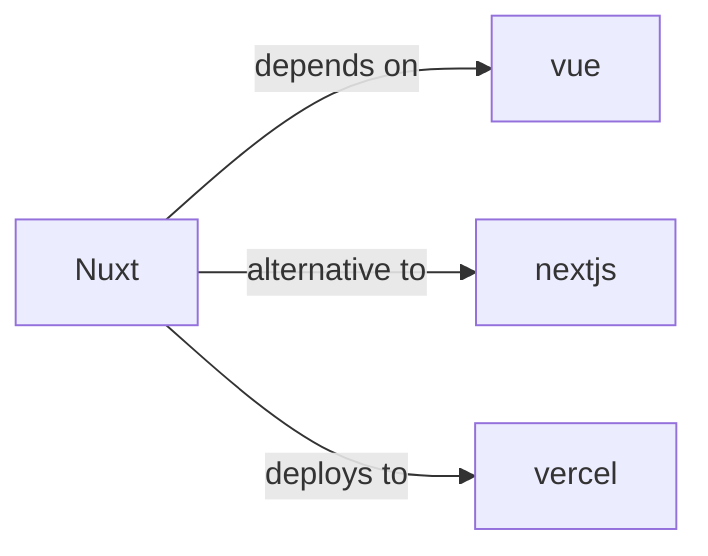

# nuxt

<p class="skill-meta">Frontend Frameworks</p>


<div class="trust-panel">

| | |
| :--- | :--- |
| **Validation** | validated |
| **Schema** | 1.0.0 |
| **Maintainer** | Awesome API Skills Team |
| **Updated** | 2026-07-02 |
| **Languages** | typescript |
| **Agents** | cursor, claude-code, cline, continue |
| **Doc source** | [official docs](https://nuxt.com/docs) |

</div>


## Graph

- **depends on** → [vue](/skills/vue)
- **alternative to** → [nextjs](/skills/nextjs)
- **deploys to** → [vercel](/skills/vercel)

---

# Nuxt Skill

> The Intuitive Vue Framework.

## Ecosystem Graph



## Quick Start
Nuxt 3 is the enterprise Vue framework, featuring Nitro (an ultra-fast server engine) and automatic component importing.

```bash
npx nuxi@latest init my-app
```

## Production Patterns
### Server API Routes
Nuxt provides a `server/api` directory. Functions exported here are automatically mapped to `/api/*` endpoints. Use these routes to hide database credentials and interact securely with APIs like Stripe or Neon.

## Architecture & Scaling
### Universal Rendering
By default, Nuxt executes code on both the server (for SSR HTML generation) and the client (hydration). Always guard browser-specific APIs (like `window.localStorage`) by wrapping them in `if (import.meta.client)`.

## Error Recovery
Use the `app.vue` `NuxtErrorBoundary` component to isolate crashes. For server-side API errors, return `createError({ statusCode: 400, statusMessage: 'Invalid' })`.

## Security Notes
Ensure sensitive tokens (like a Stripe Secret Key) are placed in the `runtimeConfig` without exposing them in the `public` sub-object.

## Relationships
**Prerequisites**: [vue](/skills/vue)

**Alternatives**: [nextjs](/skills/nextjs)

**Deploys To**: [vercel](/skills/vercel)

## References
- [Nuxt Docs](https://nuxt.com/docs)

## Why use this skill
Use this when your agent works with **nuxt** — structured patterns beat pasted docs and prevent common hallucinations.

## AI pitfalls
- Using outdated SDK or API versions from training data
- Inventing environment variable names
- Omitting error handling and retry logic

## Production checklist
- [ ] Secrets in environment variables, not source code
- [ ] Error handling and logging in place
- [ ] Rate limits and timeouts configured

## Related skills
- [`vue`](../vue/SKILL.md) — depends on
- [`nextjs`](../nextjs/SKILL.md) — alternative to
- [`vercel`](../vercel/SKILL.md) — deploys to

---
> **Last Verified:** 2026-07-02

