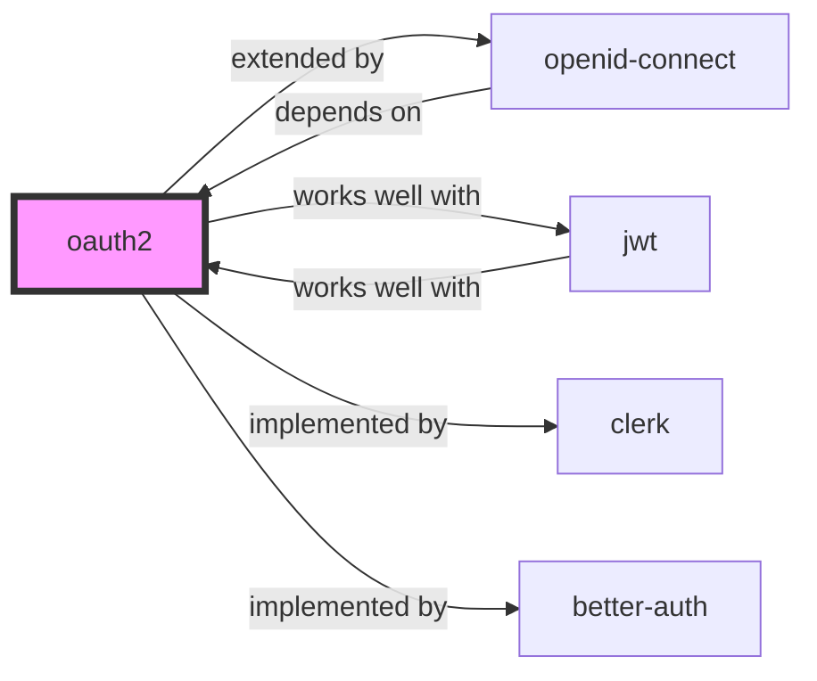

# oauth2

Authentication · Security

| | |
| :--- | :--- |
| **Validation** | validated |
| **Schema** | 1.0.0 |
| **Maintainer** | Awesome API Skills Team |
| **Updated** | 2026-07-02 |
| **Languages** | yaml |
| **Agents** | cursor, claude-code, cline, continue |
| **Doc source** | [official docs](https://oauth.net/2/) |

## Graph

- **extended by** → [openid-connect](/skills/openid-connect)
- **works well with** → [jwt](/skills/jwt)
- **implemented by** → [clerk](/skills/clerk)
- **implemented by** → [better-auth](/skills/better-auth)

---

# OAuth 2.0 Skill

> The industry-standard protocol for authorization.

## Ecosystem Graph Preview

## Recommended Next Skills

- **[jwt](/skills/jwt)** (Score: 0.92)
  *Why: Direct relationship, Both are Authentication, Shared ecosystem (security), Can deploy to any, Similar network profile*
- **[openid-connect](/skills/openid-connect)** (Score: 0.92)
  *Why: Direct relationship, Both are Authentication, Shared ecosystem (security), Can deploy to any, Similar network profile*
- **[better-auth](/skills/better-auth)** (Score: 0.72)
  *Why: Direct relationship, Both are Authentication, Similar network profile*

## Quick Start
OAuth 2.0 is an authorization framework that allows a third-party application to obtain limited access to an HTTP service, either on behalf of a resource owner or by allowing the third-party application to obtain access on its own behalf.

## Production Patterns
### Authorization Code Flow with PKCE
For single-page apps (React/Vue) and mobile apps, never use the Implicit Flow. Always use the Authorization Code Flow with PKCE (Proof Key for Code Exchange) to prevent authorization code interception attacks.

## Architecture & Scaling
### Scopes
Design your scopes to be granular (`read:users`, `write:orders`). When requesting access from a user, request the absolute minimum permissions necessary to function.

## Error Recovery
If an access token expires (HTTP 401), automatically trigger the Refresh Token flow silently in the background, update the token, and retry the original HTTP request without forcing the user to log in again.

## Security Notes
Never store the Client Secret in a frontend application or mobile app. State parameters must be cryptographically secure random strings to prevent CSRF attacks during the OAuth redirect.

## References
- [OAuth.net](https://oauth.net/2/)

## Why use this skill
Use this when your agent works with **oauth2** — structured patterns beat pasted docs and prevent common hallucinations.

## AI pitfalls
- Using outdated SDK or API versions from training data
- Inventing environment variable names
- Omitting error handling and retry logic

## Production checklist
- [ ] Secrets in environment variables, not source code
- [ ] Error handling and logging in place
- [ ] Rate limits and timeouts configured

## Related skills
- [`openid-connect`](../openid-connect/SKILL.md) — extended by
- [`jwt`](../jwt/SKILL.md) — works well with
- [`clerk`](../clerk/SKILL.md) — implemented by
- [`better-auth`](../better-auth/SKILL.md) — implemented by

---
> **Last Verified:** 2026-07-02

