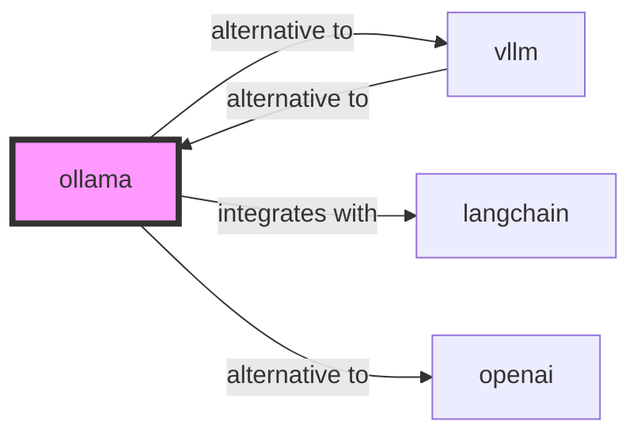

# ollama

<p class="skill-meta">AI · Developer Tools</p>


<div class="trust-panel">
  <div class="trust-header">
    <div class="trust-badge">
      <span class="pulse-dot"></span>
      <span>validated</span>
    </div>
    <span class="trust-version">Schema v1.0.0</span>
  </div>
  <div class="trust-grid">
    <div class="trust-item">
      <span class="trust-label">Maintainer</span>
      <span class="trust-val">Awesome API Skills Team</span>
    </div>
    <div class="trust-item">
      <span class="trust-label">Last Verified</span>
      <span class="trust-val">2026-07-02</span>
    </div>
    <div class="trust-item">
      <span class="trust-label">Languages</span>
      <span class="trust-val">yaml, bash</span>
    </div>
    <div class="trust-item">
      <span class="trust-label">Supported Agents</span>
      <span class="trust-val">cursor, claude-code, cline, continue</span>
    </div>
  </div>
  <div class="trust-doc-link"><a href="https://github.com/ollama/ollama" target="_blank" rel="noopener">Official Documentation ↗</a></div>
</div>


## Graph

- **alternative to** → [vllm](/skills/vllm)
- **integrates with** → [langchain](/skills/langchain)
- **alternative to** → [openai](/skills/openai)

---


> Get up and running with large language models locally.

## Ecosystem Graph Preview



## Recommended Next Skills

- **[vllm](/skills/vllm)** (Score: 0.92)
  *Why: Direct relationship, Both are AI, Shared ecosystem (ai), Can deploy to docker, Similar network profile*
- **[langchain](/skills/langchain)** (Score: 0.88)
  *Why: Direct relationship, Both are AI, Shared ecosystem (ai), Similar network profile, Logical next step*
- **[openai](/skills/openai)** (Score: 0.76)
  *Why: Direct relationship, Both are AI, Similar network profile, Logical next step*

## Quick Start
Ollama bundles model weights, configuration, and data into a single package. It exposes a local REST API that perfectly mimics the OpenAI API, making local AI drop-in compatible with existing tooling.

```bash
ollama run llama3
```

## Production Patterns
### Model Customization (Modelfiles)
Do not rely on system prompts passed via the API for complex, repetitive behaviors. Create a `Modelfile` to bake the system prompt, parameters (temperature), and custom logic into a new, specialized local model.

## Architecture & Scaling
### CPU vs GPU
Ollama automatically detects Apple Silicon, NVIDIA, and AMD GPUs. If VRAM is insufficient, it dynamically offloads layers to system RAM and the CPU, allowing massive models to run (albeit slower) on consumer hardware.

## Error Recovery
If the Ollama daemon consumes too much VRAM and refuses to unload a model, simply restart the Ollama service. Models are cached in memory for 5 minutes by default after the last request.

## Security Notes
By default, the Ollama API binds to `127.0.0.1`. If you expose it to a local network (`OLLAMA_HOST=0.0.0.0`), beware that there is absolutely zero built-in authentication.

## References
- [Ollama Docs](https://github.com/ollama/ollama)

## Why use this skill
Use this when your agent works with **ollama** — structured patterns beat pasted docs and prevent common hallucinations.

## AI pitfalls
- Using deprecated model IDs or wrong API endpoints
- Confusing chat vs completions vs embeddings APIs
- Omitting rate-limit and token budget handling

## Production checklist
- [ ] Secrets in environment variables, not source code
- [ ] Error handling and logging in place
- [ ] Rate limits and timeouts configured

## Related skills
- [`vllm`](../vllm/SKILL.md) — alternative to
- [`langchain`](../langchain/SKILL.md) — integrates with
- [`openai`](../openai/SKILL.md) — alternative to

---
> **Last Verified:** 2026-07-02

