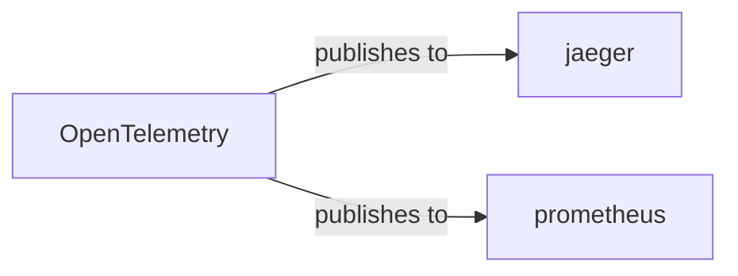

# opentelemetry

<p class="skill-meta">Observability</p>


<div class="trust-panel">

| | |
| :--- | :--- |
| **Validation** | validated |
| **Schema** | 1.0.0 |
| **Maintainer** | Awesome API Skills Team |
| **Updated** | 2026-06-29 |
| **Languages** | typescript |
| **Agents** | cursor, claude-code, cline, continue |
| **Doc source** | [official docs](https://opentelemetry.io/docs/) |

</div>


## Graph

- **publishes to** → [jaeger](/skills/jaeger)
- **publishes to** → [prometheus](/skills/prometheus)

---

# OpenTelemetry Skill

> High-quality, ubiquitous, and portable telemetry to enable effective observability.

## Ecosystem Graph



## Quick Start
OpenTelemetry (OTel) provides a vendor-neutral standard for instrumenting code. You instrument once, and route telemetry data to Datadog, Jaeger, or Honeycomb interchangeably via the OTel Collector.

```bash
npm install @opentelemetry/api @opentelemetry/sdk-node
```

## Production Patterns
### The Collector Architecture
Never send telemetry directly from your application to a backend vendor (e.g., sending traces directly to Honeycomb). Always send data to a local OpenTelemetry Collector (running as a sidecar or daemonset), which batches, compresses, and forwards the data securely.

## Architecture & Scaling
### Context Propagation
For distributed tracing to work, the unique `trace_id` must be passed between microservices. OTel achieves this automatically by injecting W3C Trace Context headers into outgoing HTTP/gRPC requests.

## Error Recovery
Telemetry SDKs are designed to fail silently. If the Collector goes down, the application will drop traces rather than crashing. Ensure you have infrastructure-level alerts tracking Collector health.

## Security Notes
Be extremely careful not to trace raw SQL queries containing PII, or log full HTTP request bodies containing passwords. Utilize OTel Collector processors to redact sensitive fields before data leaves your network.

## Relationships
## References
- [OpenTelemetry Docs](https://opentelemetry.io/docs/)

## Why use this skill
Use this when your agent works with **opentelemetry** — structured patterns beat pasted docs and prevent common hallucinations.

## AI pitfalls
- Using outdated SDK or API versions from training data
- Inventing environment variable names
- Omitting error handling and retry logic

## Production checklist
- [ ] Secrets in environment variables, not source code
- [ ] Error handling and logging in place
- [ ] Rate limits and timeouts configured

## Related skills
- [`jaeger`](../jaeger/SKILL.md) — publishes to
- [`prometheus`](../prometheus/SKILL.md) — publishes to

