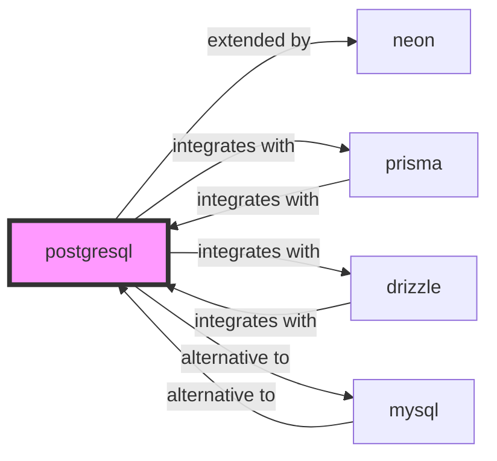

# postgresql

<p class="skill-meta">Databases</p>


<div class="trust-panel">

| | |
| :--- | :--- |
| **Validation** | validated |
| **Schema** | 1.0.0 |
| **Maintainer** | Awesome API Skills Team |
| **Updated** | 2026-07-02 |
| **Languages** | sql |
| **Agents** | cursor, claude-code, cline, continue |
| **Doc source** | [official docs](https://www.postgresql.org/docs/) |

</div>


## Graph

- **extended by** → [neon](/skills/neon)
- **integrates with** → [prisma](/skills/prisma)
- **integrates with** → [drizzle](/skills/drizzle)
- **alternative to** → [mysql](/skills/mysql)

---

# PostgreSQL Skill

> The world's most advanced open source relational database.

## Ecosystem Graph Preview



## Recommended Next Skills

- **[mysql](/skills/mysql)** (Score: 0.93)
  *Why: Direct relationship, Both are Databases, Shared ecosystem (database), Can deploy to aws, Similar network profile*
- **[drizzle](/skills/drizzle)** (Score: 0.74)
  *Why: Direct relationship, Both are Databases, Similar network profile*
- **[prisma](/skills/prisma)** (Score: 0.73)
  *Why: Direct relationship, Both are Databases, Similar network profile*

## Quick Start
PostgreSQL is the gold standard for relational data. It supports advanced JSONB querying, vector similarity (pgvector), and complex window functions.

```bash
docker run -d -p 5432:5432 -e POSTGRES_PASSWORD=secret postgres:16
```

## Production Patterns
### Connection Pooling
Postgres spawns a new OS process per connection (unlike MySQL's threads). In serverless environments, this quickly exhausts memory. You MUST use a connection pooler like PgBouncer or a managed serverless Postgres like Neon/Supabase to multiplex connections.

## Architecture & Scaling
### JSONB vs Relational
Use `JSONB` for unstructured metadata (like user preferences), but do not store core domain entities in JSONB. You lose foreign key constraints and standard indexing performance.

## Error Recovery
If transactions frequently deadlock, ensure all your application transactions acquire locks in the exact same deterministic order, and keep transactions as short as possible.

## Security Notes
Never connect as the `postgres` superuser from your application. Create a dedicated application user with strictly limited schema access (`GRANT SELECT, INSERT ON ALL TABLES...`).

## References
- [PostgreSQL Docs](https://www.postgresql.org/docs/)

## Why use this skill
Use this when your agent works with **postgresql** — structured patterns beat pasted docs and prevent common hallucinations.

## AI pitfalls
- Inventing column names or schema fields
- Using deprecated driver methods or wrong connection strings
- Omitting connection pooling or transaction boundaries

## Production checklist
- [ ] Migrations version-controlled and applied via CI
- [ ] Connection limits and pooling configured
- [ ] Backups and restore procedure documented

## Related skills
- [`neon`](../neon/SKILL.md) — extended by
- [`prisma`](../prisma/SKILL.md) — integrates with
- [`drizzle`](../drizzle/SKILL.md) — integrates with
- [`mysql`](../mysql/SKILL.md) — alternative to

---
> **Last Verified:** 2026-07-02

