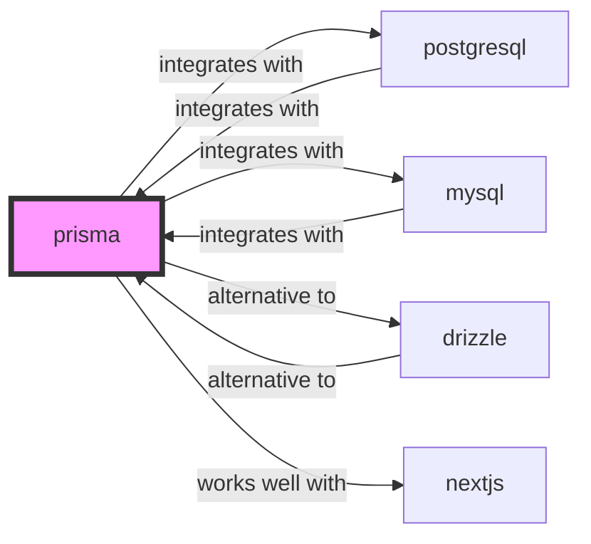

# prisma

<p class="skill-meta">Databases · Developer Tools</p>


<div class="trust-panel">
  <div class="trust-header">
    <div class="trust-badge">
      <span class="pulse-dot"></span>
      <span>validated</span>
    </div>
    <span class="trust-version">Schema v1.0.0</span>
  </div>
  <div class="trust-grid">
    <div class="trust-item">
      <span class="trust-label">Maintainer</span>
      <span class="trust-val">Awesome API Skills Team</span>
    </div>
    <div class="trust-item">
      <span class="trust-label">Last Verified</span>
      <span class="trust-val">2026-07-02</span>
    </div>
    <div class="trust-item">
      <span class="trust-label">Languages</span>
      <span class="trust-val">prisma, typescript</span>
    </div>
    <div class="trust-item">
      <span class="trust-label">Supported Agents</span>
      <span class="trust-val">cursor, claude-code, cline, continue</span>
    </div>
  </div>
  <div class="trust-doc-link"><a href="https://www.prisma.io/docs/" target="_blank" rel="noopener">Official Documentation ↗</a></div>
</div>


## Graph

- **integrates with** → [postgresql](/skills/postgresql)
- **integrates with** → [mysql](/skills/mysql)
- **alternative to** → [drizzle](/skills/drizzle)
- **works well with** → [nextjs](/skills/nextjs)
- **integrates with** ← [mongodb-atlas](/skills/mongodb-atlas)

---


> Next-generation Node.js and TypeScript ORM.

## Ecosystem Graph Preview



## Recommended Next Skills

- **[drizzle](/skills/drizzle)** (Score: 0.92)
  *Why: Direct relationship, Both are Databases, Shared ecosystem (typescript), Can deploy to vercel, Similar network profile*
- **[mysql](/skills/mysql)** (Score: 0.73)
  *Why: Direct relationship, Both are Databases, Similar network profile*
- **[postgresql](/skills/postgresql)** (Score: 0.73)
  *Why: Direct relationship, Both are Databases, Similar network profile*

## Quick Start
Prisma provides an intuitive data model definition format and auto-generates a fully type-safe database client.

```bash
npm install prisma --save-dev
npx prisma init
```

## Production Patterns
### Migration Workflows
Never run `npx prisma db push` in production. Always use `npx prisma migrate deploy` to ensure a strict, version-controlled history of schema changes executes atomically.

## Architecture & Scaling
### The Rust Query Engine
Prisma uses a Rust query engine running as a sidecar process. This provides advanced features but increases memory footprint and serverless cold starts. Ensure you use `@prisma/client/edge` if deploying to Edge runtimes.

## Error Recovery
Handle `PrismaClientKnownRequestError` specifically to catch and gracefully resolve common constraints (e.g., catching code `P2002` for unique constraint violations during user registration).

## Security Notes
Do not expose Prisma Studio (`npx prisma studio`) to the public internet. It provides full root access to your database.

## References
- [Prisma Docs](https://www.prisma.io/docs/)

## Why use this skill
Use this when your agent works with **prisma** — structured patterns beat pasted docs and prevent common hallucinations.

## AI pitfalls
- Inventing column names or schema fields
- Using deprecated driver methods or wrong connection strings
- Omitting connection pooling or transaction boundaries

## Production checklist
- [ ] Migrations version-controlled and applied via CI
- [ ] Connection limits and pooling configured
- [ ] Backups and restore procedure documented

## Related skills
- [`postgresql`](../postgresql/SKILL.md) — integrates with
- [`mysql`](../mysql/SKILL.md) — integrates with
- [`drizzle`](../drizzle/SKILL.md) — alternative to
- [`nextjs`](../nextjs/SKILL.md) — works well with

---
> **Last Verified:** 2026-07-02

