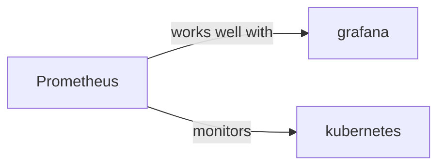

# prometheus

<p class="skill-meta">Observability</p>


<div class="trust-panel">
  <div class="trust-header">
    <div class="trust-badge">
      <span class="pulse-dot"></span>
      <span>validated</span>
    </div>
    <span class="trust-version">Schema v1.0.0</span>
  </div>
  <div class="trust-grid">
    <div class="trust-item">
      <span class="trust-label">Maintainer</span>
      <span class="trust-val">Awesome API Skills Team</span>
    </div>
    <div class="trust-item">
      <span class="trust-label">Last Verified</span>
      <span class="trust-val">2026-07-02</span>
    </div>
    <div class="trust-item">
      <span class="trust-label">Languages</span>
      <span class="trust-val">yaml</span>
    </div>
    <div class="trust-item">
      <span class="trust-label">Supported Agents</span>
      <span class="trust-val">cursor, claude-code, cline, continue</span>
    </div>
  </div>
  <div class="trust-doc-link"><a href="https://prometheus.io/docs/introduction/overview/" target="_blank" rel="noopener">Official Documentation ↗</a></div>
</div>


## Graph

- **works well with** → [grafana](/skills/grafana)
- **monitors** → [kubernetes](/skills/kubernetes)
- **works well with** ← [loki](/skills/loki)
- **publishes to** ← [opentelemetry](/skills/opentelemetry)

---


> Powering metrics and alerting.

## Ecosystem Graph



## Quick Start
Prometheus is a pull-based time-series database. It scrapes `/metrics` endpoints across your infrastructure at regular intervals and stores them.

```bash
docker run -p 9090:9090 prom/prometheus
```

## Production Patterns
### Exporters
Do not manually instrument standard infrastructure. Use Exporters (e.g., `node_exporter` for Linux stats, `postgres_exporter` for DB stats) which automatically expose standard metrics in the Prometheus format.

## Architecture & Scaling
### Pull vs Push
Prometheus pulls metrics. In serverless environments (like AWS Lambda) where services are ephemeral and cannot be scraped, you must push metrics to a Prometheus Pushgateway, which Prometheus then scrapes.

## Error Recovery
Prometheus is heavily memory-bound. If it OOMs, check your label cardinality. High cardinality (e.g., tracking a user ID as a label on every metric) will exponentially explode the TSDB and crash the server.

## Security Notes
Prometheus scrape endpoints (`/metrics`) often contain sensitive infrastructure data. Ensure these endpoints are strictly inaccessible from the public internet (e.g., via internal Kubernetes network policies).

## Relationships
**Works Well With**: [grafana](/skills/grafana)

## References
- [Prometheus Docs](https://prometheus.io/docs/introduction/overview/)

## Why use this skill
Use this when your agent works with **prometheus** — structured patterns beat pasted docs and prevent common hallucinations.

## AI pitfalls
- Using outdated SDK or API versions from training data
- Inventing environment variable names
- Omitting error handling and retry logic

## Production checklist
- [ ] Secrets in environment variables, not source code
- [ ] Error handling and logging in place
- [ ] Rate limits and timeouts configured

## Related skills
- [`grafana`](../grafana/SKILL.md) — works well with
- [`kubernetes`](../kubernetes/SKILL.md) — monitors

---
> **Last Verified:** 2026-07-02

