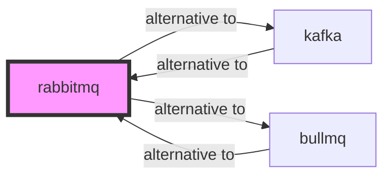

# rabbitmq

<p class="skill-meta">Messaging · Enterprise</p>


<div class="trust-panel">

| | |
| :--- | :--- |
| **Validation** | validated |
| **Schema** | 1.0.0 |
| **Maintainer** | Awesome API Skills Team |
| **Updated** | 2026-06-29 |
| **Languages** | typescript |
| **Agents** | cursor, claude-code, cline, continue |
| **Doc source** | [official docs](https://www.rabbitmq.com/documentation.html) |

</div>


## Graph

- **alternative to** → [kafka](/skills/kafka)
- **alternative to** → [bullmq](/skills/bullmq)

---

# RabbitMQ Skill

> Reliable, mature AMQP message broker.

## Ecosystem Graph Preview



## Recommended Next Skills

- **[kafka](/skills/kafka)** (Score: 0.9)
  *Why: Direct relationship, Both are Messaging, Shared ecosystem (infrastructure), Can deploy to kubernetes*
- **[bullmq](/skills/bullmq)** (Score: 0.8)
  *Why: Direct relationship, Both are Messaging, Can deploy to docker*
- **[redis-streams](/skills/redis-streams)** (Score: 0.33)
  *Why: Both are Messaging, Can deploy to aws, Similar network profile*

## Quick Start
RabbitMQ uses the AMQP protocol to route messages between producers and consumers using highly configurable Exchanges and Queues.

```bash
docker run -d -p 5672:5672 -p 15672:15672 rabbitmq:3-management
```

## Production Patterns
### Acknowledgements
Never use auto-acknowledgement in production. Consumers must explicitly acknowledge (`ack`) the message *after* successfully processing it. If the worker crashes, RabbitMQ will requeue the message.

## Architecture & Scaling
### Exchanges vs Queues
Producers never publish directly to queues; they publish to Exchanges. Configure a `topic` exchange to route messages to multiple queues based on routing keys (e.g., `user.created` goes to both the email queue and analytics queue).

## Error Recovery
Always configure a Dead Letter Exchange (DLX). If a message fails processing multiple times (poison pill), route it to the DLX for manual inspection rather than infinitely looping and crashing the worker.

## Security Notes
Do not expose the management UI (port 15672) to the internet. Enforce TLS for all AMQP connections to prevent packet sniffing of message payloads.

## References
- [RabbitMQ Docs](https://www.rabbitmq.com/documentation.html)

## Why use this skill
Use this when your agent works with **rabbitmq** — structured patterns beat pasted docs and prevent common hallucinations.

## AI pitfalls
- Using outdated SDK or API versions from training data
- Inventing environment variable names
- Omitting error handling and retry logic

## Production checklist
- [ ] Secrets in environment variables, not source code
- [ ] Error handling and logging in place
- [ ] Rate limits and timeouts configured

## Related skills
- [`kafka`](../kafka/SKILL.md) — alternative to
- [`bullmq`](../bullmq/SKILL.md) — alternative to

