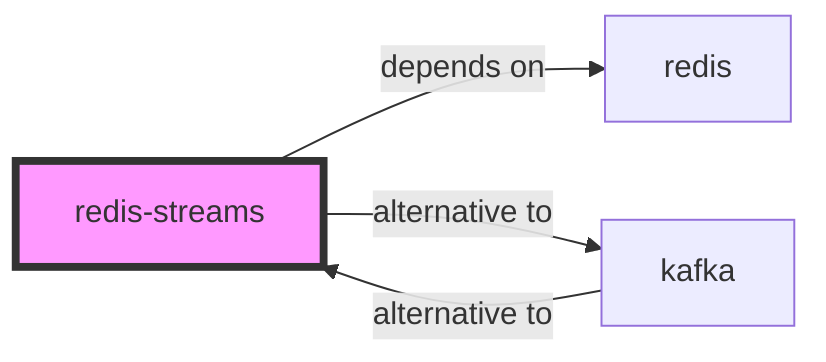

# redis-streams

<p class="skill-meta">Messaging · Databases</p>


<div class="trust-panel">

| | |
| :--- | :--- |
| **Validation** | validated |
| **Schema** | 1.0.0 |
| **Maintainer** | Awesome API Skills Team |
| **Updated** | 2026-07-02 |
| **Languages** | typescript |
| **Agents** | cursor, claude-code, cline, continue |
| **Doc source** | [official docs](https://redis.io/docs/data-types/streams/) |

</div>


## Graph

- **depends on** → [redis](/skills/redis)
- **alternative to** → [kafka](/skills/kafka)

---

# Redis Streams Skill

> A data type in Redis that models an append-only log.

## Ecosystem Graph Preview



## Recommended Next Skills

- **[kafka](/skills/kafka)** (Score: 0.8)
  *Why: Direct relationship, Both are Messaging, Can deploy to aws*
- **[redis](/skills/redis)** (Score: 0.7)
  *Why: Direct relationship, Both are Databases*
- **[mysql](/skills/mysql)** (Score: 0.4)
  *Why: Both are Databases, Shared ecosystem (database), Can deploy to aws*

## Quick Start
Redis Streams acts similarly to Kafka, providing an append-only log that multiple consumer groups can read from simultaneously.

```bash
# XADD key ID field value
redis-cli XADD mystream * sensor-id 1234 temp 19.8
```

## Production Patterns
### Consumer Groups
Do not use simple `XREAD` if you have multiple workers. Use Consumer Groups (`XGROUP CREATE`). This ensures that a single message in the stream is delivered to exactly one worker in the group, enabling horizontal scaling.

## Architecture & Scaling
### Trimming
Unlike Kafka, which uses disk, Redis Streams live in memory. You MUST trim the stream (`MAXLEN`) during `XADD` or via a background job, otherwise the stream will consume all Redis RAM and crash the server.

## Error Recovery
If a consumer crashes before acknowledging a message, that message remains in the Pending Entries List (PEL). Write a separate cleanup worker that periodically inspects the PEL (`XPENDING`) and reassigns (`XCLAIM`) stalled messages to healthy workers.

## Security Notes
When exposing Redis via Upstash or external providers, always enforce TLS and strongly generated ACL passwords. Never use the default `default` user for application connections.

## References
- [Redis Streams](https://redis.io/docs/data-types/streams/)

## Why use this skill
Use this when your agent works with **redis-streams** — structured patterns beat pasted docs and prevent common hallucinations.

## AI pitfalls
- Inventing column names or schema fields
- Using deprecated driver methods or wrong connection strings
- Omitting connection pooling or transaction boundaries

## Production checklist
- [ ] Migrations version-controlled and applied via CI
- [ ] Connection limits and pooling configured
- [ ] Backups and restore procedure documented

## Related skills
- [`redis`](../redis/SKILL.md) — depends on
- [`kafka`](../kafka/SKILL.md) — alternative to

---
> **Last Verified:** 2026-07-02

