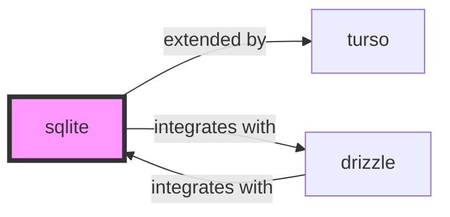

# sqlite

<p class="skill-meta">Databases</p>


<div class="trust-panel">

| | |
| :--- | :--- |
| **Validation** | validated |
| **Schema** | 1.0.0 |
| **Maintainer** | Awesome API Skills Team |
| **Updated** | 2026-06-29 |
| **Languages** | sql |
| **Agents** | cursor, claude-code, cline, continue |
| **Doc source** | [official docs](https://www.sqlite.org/docs.html) |

</div>


## Graph

- **extended by** → [turso](/skills/turso)
- **integrates with** → [drizzle](/skills/drizzle)

---

# SQLite Skill

> Small, fast, reliable, embedded database.

## Ecosystem Graph Preview



## Recommended Next Skills

- **[drizzle](/skills/drizzle)** (Score: 0.86)
  *Why: Direct relationship, Both are Databases, Can deploy to cloudflare, Similar network profile, Logical next step*
- **[turso](/skills/turso)** (Score: 0.77)
  *Why: Direct relationship, Both are Databases, Similar network profile, Logical next step*
- **[mysql](/skills/mysql)** (Score: 0.37)
  *Why: Both are Databases, Shared ecosystem (database), Similar network profile, Logical next step*

## Quick Start
SQLite is an embedded database. It doesn't run as a background service; it is just a C library that reads and writes directly to an ordinary disk file.

```bash
sqlite3 mydatabase.db
```

## Production Patterns
### WAL Mode
By default, SQLite uses a rollback journal which blocks all readers during a write. For production web applications, you MUST execute `PRAGMA journal_mode=WAL;`. This enables Write-Ahead Logging, allowing concurrent readers and writers.

## Architecture & Scaling
### Edge Replication
Modern cloud-native platforms like Turso (libSQL) or Cloudflare D1 allow you to replicate SQLite files directly to edge nodes worldwide, enabling sub-millisecond local reads with global consistency.

## Error Recovery
If you receive `SQLITE_BUSY` errors, increase the busy timeout (`PRAGMA busy_timeout = 5000;`). This tells SQLite to wait for 5 seconds for a lock to clear before throwing the exception.

## Security Notes
SQLite files should never be placed in a public-facing web directory. Secure the file permissions to ensure only the application process owner can read or write the `.db` file.

## References
- [SQLite Docs](https://www.sqlite.org/docs.html)

## Why use this skill
Use this when your agent works with **sqlite** — structured patterns beat pasted docs and prevent common hallucinations.

## AI pitfalls
- Inventing column names or schema fields
- Using deprecated driver methods or wrong connection strings
- Omitting connection pooling or transaction boundaries

## Production checklist
- [ ] Migrations version-controlled and applied via CI
- [ ] Connection limits and pooling configured
- [ ] Backups and restore procedure documented

## Related skills
- [`turso`](../turso/SKILL.md) — extended by
- [`drizzle`](../drizzle/SKILL.md) — integrates with

