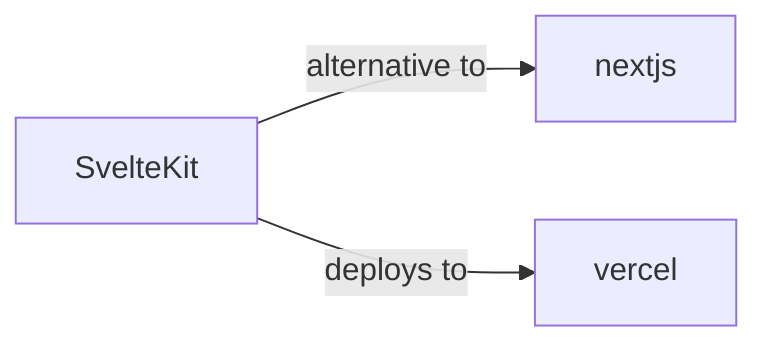

# sveltekit

<p class="skill-meta">Frontend Frameworks</p>


<div class="trust-panel">
  <div class="trust-header">
    <div class="trust-badge">
      <span class="pulse-dot"></span>
      <span>validated</span>
    </div>
    <span class="trust-version">Schema v1.0.0</span>
  </div>
  <div class="trust-grid">
    <div class="trust-item">
      <span class="trust-label">Maintainer</span>
      <span class="trust-val">Awesome API Skills Team</span>
    </div>
    <div class="trust-item">
      <span class="trust-label">Last Verified</span>
      <span class="trust-val">2026-07-02</span>
    </div>
    <div class="trust-item">
      <span class="trust-label">Languages</span>
      <span class="trust-val">typescript</span>
    </div>
    <div class="trust-item">
      <span class="trust-label">Supported Agents</span>
      <span class="trust-val">cursor, claude-code, cline, continue</span>
    </div>
  </div>
  <div class="trust-doc-link"><a href="https://kit.svelte.dev/docs" target="_blank" rel="noopener">Official Documentation ↗</a></div>
</div>


## Graph

- **alternative to** → [nextjs](/skills/nextjs)
- **deploys to** → [vercel](/skills/vercel)
- **alternative to** ← [react](/skills/react)

---


> Web development, streamlined.

## Ecosystem Graph



## Quick Start
SvelteKit compiles away the framework. Instead of a virtual DOM, it generates highly optimized vanilla JavaScript. It uses a file-based routing system (e.g., `+page.svelte` and `+page.server.ts`).

```bash
npm create svelte@latest my-app
```

## Production Patterns
### Form Actions
SvelteKit heavily utilizes native HTML forms for mutations. Write a `default` action in `+page.server.ts` to handle POST requests, interact with your database, and return validation errors seamlessly without requiring client-side `fetch`.

## Architecture & Scaling
### Load Functions
Use `+page.server.ts` to export a `load` function. This function runs strictly on the server, fetching database records securely, and passes the resolved props directly to the `+page.svelte` component during SSR.

## Error Recovery
Throw `error(404, 'Not found')` from your load functions. SvelteKit automatically renders the nearest `+error.svelte` boundary.

## Security Notes
Form actions automatically protect against CSRF attacks. Do not disable this protection unless building a public API endpoint, in which case you should use a `+server.ts` standalone route.

## Relationships
**Alternatives**: [nextjs](/skills/nextjs)

**Deploys To**: [vercel](/skills/vercel)

## References
- [SvelteKit Docs](https://kit.svelte.dev/docs)

## Why use this skill
Use this when your agent works with **sveltekit** — structured patterns beat pasted docs and prevent common hallucinations.

## AI pitfalls
- Using outdated SDK or API versions from training data
- Inventing environment variable names
- Omitting error handling and retry logic

## Production checklist
- [ ] Secrets in environment variables, not source code
- [ ] Error handling and logging in place
- [ ] Rate limits and timeouts configured

## Related skills
- [`nextjs`](../nextjs/SKILL.md) — alternative to
- [`vercel`](../vercel/SKILL.md) — deploys to

---
> **Last Verified:** 2026-07-02

