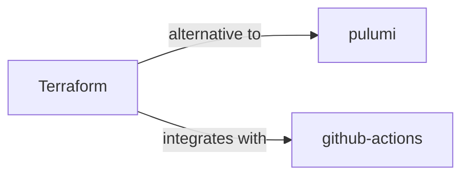

# terraform

<p class="skill-meta">Developer Tools · Infrastructure</p>


<div class="trust-panel">
  <div class="trust-header">
    <div class="trust-badge">
      <span class="pulse-dot"></span>
      <span>validated</span>
    </div>
    <span class="trust-version">Schema v1.0.0</span>
  </div>
  <div class="trust-grid">
    <div class="trust-item">
      <span class="trust-label">Maintainer</span>
      <span class="trust-val">Awesome API Skills Team</span>
    </div>
    <div class="trust-item">
      <span class="trust-label">Last Verified</span>
      <span class="trust-val">2026-07-02</span>
    </div>
    <div class="trust-item">
      <span class="trust-label">Languages</span>
      <span class="trust-val">yaml</span>
    </div>
    <div class="trust-item">
      <span class="trust-label">Supported Agents</span>
      <span class="trust-val">cursor, claude-code, cline, continue</span>
    </div>
  </div>
  <div class="trust-doc-link"><a href="https://developer.hashicorp.com/terraform/docs" target="_blank" rel="noopener">Official Documentation ↗</a></div>
</div>


## Graph

- **alternative to** → [pulumi](/skills/pulumi)
- **integrates with** → [github-actions](/skills/github-actions)
- **provisioned by** ← [aws-dynamodb](/skills/aws-dynamodb)
- **provisioned by** ← [aws-s3](/skills/aws-s3)

---


> Infrastructure as Code.

## Ecosystem Graph



## Quick Start
Terraform allows you to declare cloud infrastructure (VPCs, Databases, Servers) in HCL (HashiCorp Configuration Language) and deploy it predictably.

```bash
terraform init
terraform plan
terraform apply
```

## Production Patterns
### State Management
Never store the `terraform.tfstate` file locally or commit it to Git. It often contains plaintext secrets (like database passwords). Always configure a remote state backend (like an encrypted AWS S3 bucket with DynamoDB state locking).

## Architecture & Scaling
### Modules
Do not write massive monolithic `main.tf` files. Break your infrastructure into logical modules (e.g., `network`, `database`, `app_cluster`) and consume them in a root configuration. This drastically reduces the blast radius of changes.

## Error Recovery
If a `terraform apply` fails halfway through, the state file may become locked or corrupted. Use `terraform state list` and `terraform state rm` surgically to remove tainted resources rather than destroying the entire environment.

## Security Notes
Use `tfsec` or `checkov` in your CI/CD pipeline to statically analyze your Terraform code for security misconfigurations (like open security groups or unencrypted S3 buckets) before they are ever deployed.

## Relationships
**Alternatives**: [pulumi](/skills/pulumi)

**Works Well With**: [github-actions](/skills/github-actions)

## References
- [Terraform Docs](https://developer.hashicorp.com/terraform/docs)

## Why use this skill
Use this when your agent works with **terraform** — structured patterns beat pasted docs and prevent common hallucinations.

## AI pitfalls
- Referencing CLI flags or config keys that do not exist
- Using outdated major versions of tools
- Skipping lockfile or version pinning in examples

## Production checklist
- [ ] Secrets in environment variables, not source code
- [ ] Error handling and logging in place
- [ ] Rate limits and timeouts configured

## Related skills
- [`pulumi`](../pulumi/SKILL.md) — alternative to
- [`github-actions`](../github-actions/SKILL.md) — integrates with

---
> **Last Verified:** 2026-07-02

