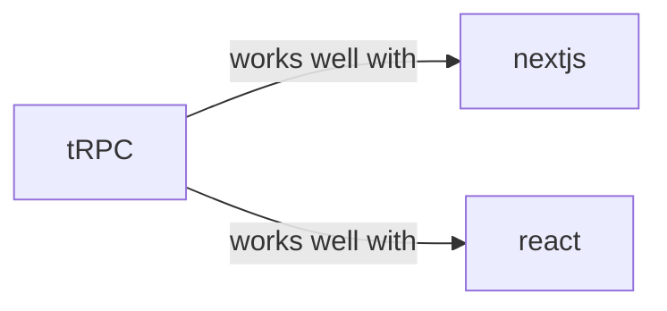

# trpc

<p class="skill-meta">Backend Frameworks · Developer Tools</p>


<div class="trust-panel">
  <div class="trust-header">
    <div class="trust-badge">
      <span class="pulse-dot"></span>
      <span>validated</span>
    </div>
    <span class="trust-version">Schema v1.0.0</span>
  </div>
  <div class="trust-grid">
    <div class="trust-item">
      <span class="trust-label">Maintainer</span>
      <span class="trust-val">Awesome API Skills Team</span>
    </div>
    <div class="trust-item">
      <span class="trust-label">Last Verified</span>
      <span class="trust-val">2026-07-02</span>
    </div>
    <div class="trust-item">
      <span class="trust-label">Languages</span>
      <span class="trust-val">typescript</span>
    </div>
    <div class="trust-item">
      <span class="trust-label">Supported Agents</span>
      <span class="trust-val">cursor, claude-code, cline, continue</span>
    </div>
  </div>
  <div class="trust-doc-link"><a href="https://trpc.io/docs" target="_blank" rel="noopener">Official Documentation ↗</a></div>
</div>


## Graph

- **works well with** → [nextjs](/skills/nextjs)
- **works well with** → [react](/skills/react)

---


> End-to-end typesafe APIs made easy.

## Ecosystem Graph



## Quick Start
tRPC allows you to easily build & consume fully typesafe APIs without schemas or code generation. It relies on TypeScript inference to share types between your server and client.

```bash
npm install @trpc/server @trpc/client @trpc/react-query @tanstack/react-query zod
```

## Production Patterns
### Input Validation
tRPC strongly integrates with Zod. Always define an `.input(z.object({...}))` schema for your mutations. tRPC will automatically reject invalid payloads before your resolver function ever executes.

## Architecture & Scaling
### Routers and Procedures
Group your endpoints into sub-routers (e.g., `userRouter`, `postRouter`) and merge them into an `appRouter`. This prevents your primary router file from becoming unmaintainable.

## Error Recovery
Throw `TRPCError` with specific codes (e.g., `UNAUTHORIZED`, `NOT_FOUND`). On the client, React Query will automatically catch these and expose them via the `error` object.

## Security Notes
Implement a `protectedProcedure` middleware. Extract the session from the context (`ctx`), verify it, and throw a `TRPCError` if invalid. Use this procedure for all secure endpoints instead of the standard `publicProcedure`.

## Relationships
**Works Well With**: [nextjs](/skills/nextjs), [react](/skills/react)

## References
- [tRPC Docs](https://trpc.io/docs)

## Why use this skill
Use this when your agent works with **trpc** — structured patterns beat pasted docs and prevent common hallucinations.

## AI pitfalls
- Referencing CLI flags or config keys that do not exist
- Using outdated major versions of tools
- Skipping lockfile or version pinning in examples

## Production checklist
- [ ] Secrets in environment variables, not source code
- [ ] Error handling and logging in place
- [ ] Rate limits and timeouts configured

## Related skills
- [`nextjs`](../nextjs/SKILL.md) — works well with
- [`react`](../react/SKILL.md) — works well with

---
> **Last Verified:** 2026-07-02

