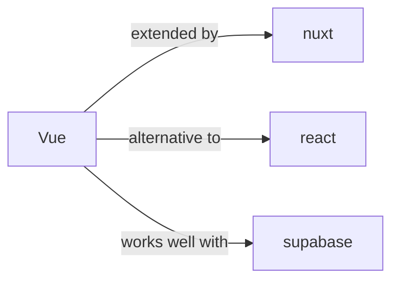

# vue

<p class="skill-meta">Frontend Frameworks</p>


<div class="trust-panel">

| | |
| :--- | :--- |
| **Validation** | validated |
| **Schema** | 1.0.0 |
| **Maintainer** | Awesome API Skills Team |
| **Updated** | 2026-07-02 |
| **Languages** | typescript |
| **Agents** | cursor, claude-code, cline, continue |
| **Doc source** | [official docs](https://vuejs.org/guide/introduction.html) |

</div>


## Graph

- **extended by** → [nuxt](/skills/nuxt)
- **alternative to** → [react](/skills/react)
- **works well with** → [supabase](/skills/supabase)

---

# Vue Skill

> The Progressive JavaScript Framework.

## Ecosystem Graph



## Quick Start
Vue 3 utilizes the Composition API, offering a highly logical and reactive way to structure components compared to the legacy Options API.

```bash
npm create vue@latest
```

## Production Patterns
### Composables
Vue's equivalent to React hooks. Use `ref` and `computed` inside standalone JavaScript functions to encapsulate and reuse stateful logic across multiple `.vue` components.

## Architecture & Scaling
### Reactivity System
Vue 3 uses JavaScript Proxies for reactivity. This means modifying nested properties of a `reactive` object works seamlessly without needing immutable state replacement (unlike React's `setState`).

## Error Recovery
Utilize `onErrorCaptured` at the layout level to catch and log errors thrown by descendant components gracefully.

## Security Notes
Be extremely cautious with the `v-html` directive. It renders raw HTML directly to the DOM and is a primary vector for XSS attacks if the input is not strictly sanitized.

## Relationships
**Alternatives**: [react](/skills/react)

**Works Well With**: [supabase](/skills/supabase)

## References
- [Vue Docs](https://vuejs.org/guide/introduction.html)

## Why use this skill
Use this when your agent works with **vue** — structured patterns beat pasted docs and prevent common hallucinations.

## AI pitfalls
- Using outdated SDK or API versions from training data
- Inventing environment variable names
- Omitting error handling and retry logic

## Production checklist
- [ ] Secrets in environment variables, not source code
- [ ] Error handling and logging in place
- [ ] Rate limits and timeouts configured

## Related skills
- [`nuxt`](../nuxt/SKILL.md) — extended by
- [`react`](../react/SKILL.md) — alternative to
- [`supabase`](../supabase/SKILL.md) — works well with

---
> **Last Verified:** 2026-07-02

