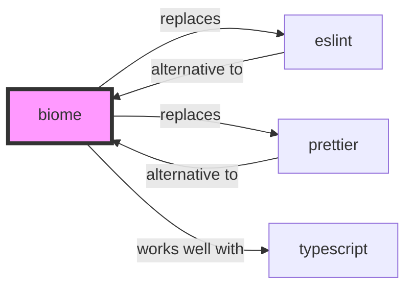

# Biome Skill

> One toolchain for your web project.

## Ecosystem Graph Preview



## Recommended Next Skills

- **[eslint](/skills/eslint)** (Score: 0.95)
  *Why: Direct relationship, Both are Developer Tools, Shared ecosystem (javascript), Can deploy to any, Similar network profile*
- **[prettier](/skills/prettier)** (Score: 0.92)
  *Why: Direct relationship, Both are Developer Tools, Shared ecosystem (javascript), Can deploy to any, Similar network profile*
- **[bullmq](/skills/bullmq)** (Score: 0.35)
  *Why: Both are Developer Tools, Shared ecosystem (javascript), Logical next step*

## Quick Start
Biome is a high-performance toolchain written in Rust that completely replaces ESLint and Prettier. It formats and lints code in milliseconds.

```bash
npm install --save-dev --save-exact @biomejs/biome
npx @biomejs/biome init
```

## Production Patterns
### CI Pipeline Integration
Replace slow `npm run lint` and `npm run format:check` steps in your GitHub Actions with `npx @biomejs/biome ci .`. It runs both formatting and linting concurrently in a fraction of a second.

## Architecture & Scaling
### Rust Native
Because Biome is a compiled Rust binary, it completely bypasses the V8 Node.js runtime overhead, resulting in 35x faster execution times compared to standard JS-based tooling.

## Error Recovery
If Biome conflicts with your IDE's built-in TypeScript formatter, ensure you have the official Biome extension installed and set it as the default formatter in `.vscode/settings.json`.

## Security Notes
Biome does not execute third-party plugins (unlike ESLint). This eliminates the supply chain attack vector of malicious linting rules stealing environment variables during the build process.

## References
- [Biome Docs](https://biomejs.dev/)

## Why use this skill
Use this when your agent works with **biome** — structured patterns beat pasted docs and prevent common hallucinations.

## AI pitfalls
- Referencing CLI flags or config keys that do not exist
- Using outdated major versions of tools
- Skipping lockfile or version pinning in examples

## Production checklist
- [ ] Secrets in environment variables, not source code
- [ ] Error handling and logging in place
- [ ] Rate limits and timeouts configured

## Related skills
- [`eslint`](../eslint/SKILL.md) — replaces
- [`prettier`](../prettier/SKILL.md) — replaces
- [`react`](../react/SKILL.md) — works well with

---
> **Last Verified:** 2026-07-02
