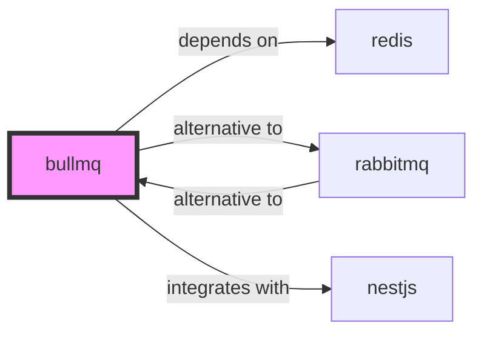

# BullMQ Skill

> Redis-based robust queue system for Node.js.

## Ecosystem Graph Preview



## Recommended Next Skills

- **[rabbitmq](/skills/rabbitmq)** (Score: 0.8)
  *Why: Direct relationship, Both are Messaging, Can deploy to docker*
- **[nestjs](/skills/nestjs)** (Score: 0.6)
  *Why: Direct relationship, Can deploy to docker*
- **[redis](/skills/redis)** (Score: 0.5)
  *Why: Direct relationship*

## Quick Start
BullMQ leverages Redis Lua scripts to provide an incredibly fast, transactional task queue natively in TypeScript.

```bash
npm install bullmq ioredis
```

## Production Patterns
### Sandboxed Processors
For CPU-intensive tasks (image resizing, PDF generation), use BullMQ Sandboxed Processors. This forces the worker to execute in a separate Node.js child process, preventing the heavy task from blocking your API's main event loop.

## Architecture & Scaling
### Redis MaxMemory
BullMQ queues can grow infinitely if consumers crash. Ensure your Redis instance is configured with a strict `maxmemory` limit and an eviction policy like `noeviction` (which causes BullMQ to gracefully pause adding jobs) to prevent OOM crashes.

## Error Recovery
Configure automatic retries with exponential backoff on your jobs (`attempts: 3, backoff: { type: 'exponential', delay: 1000 }`) to handle transient third-party API failures gracefully.

## Security Notes
Because BullMQ stores task payloads in Redis, never pass raw sensitive data (credit cards, unhashed passwords) in the `job.data` object. Pass a database ID and fetch the sensitive data securely within the worker.

## References
- [BullMQ Docs](https://docs.bullmq.io/)

## Why use this skill
Use this when your agent works with **bullmq** — structured patterns beat pasted docs and prevent common hallucinations.

## AI pitfalls
- Referencing CLI flags or config keys that do not exist
- Using outdated major versions of tools
- Skipping lockfile or version pinning in examples

## Production checklist
- [ ] Secrets in environment variables, not source code
- [ ] Error handling and logging in place
- [ ] Rate limits and timeouts configured

## Related skills
- [`redis`](../redis/SKILL.md) — depends on
- [`rabbitmq`](../rabbitmq/SKILL.md) — alternative to
- [`nestjs`](../nestjs/SKILL.md) — integrates with
