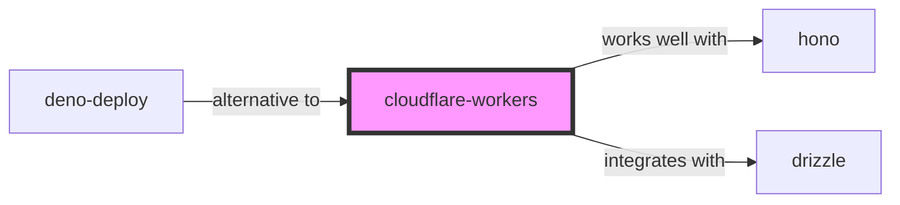

# Cloudflare Workers Skill

> Build serverless applications and deploy globally across the Cloudflare edge network.

## Ecosystem Graph Preview



## Recommended Next Skills

- **[deno-deploy](/skills/deno-deploy)** (Score: 0.82)
  *Why: Direct relationship, Both are Cloud, Shared ecosystem (javascript), Similar network profile*
- **[drizzle](/skills/drizzle)** (Score: 0.8)
  *Why: Direct relationship, Both are Developer Tools, Can deploy to cloudflare*
- **[hono](/skills/hono)** (Score: 0.72)
  *Why: Direct relationship, Shared ecosystem (javascript), Can deploy to cloudflare, Similar network profile*

## Quick Start
Workers run V8 isolates, meaning there are virtually zero cold starts compared to AWS Lambda. Your code executes physically close to the user in hundreds of data centers globally.

```bash
npm create cloudflare@latest
```

## Production Patterns
### KV and Durable Objects
Workers are stateless. To persist data at the edge, use Cloudflare KV for read-heavy eventual consistency, or Durable Objects for strongly consistent transactional state (like WebSockets or counters).

## Architecture & Scaling
### Web Standard APIs
Workers do not run Node.js (though compatibility is improving). You must use Web Standard APIs (`fetch`, `Request`, `Response`, `crypto.subtle`). Avoid libraries that depend heavily on `fs` or native Node C++ bindings.

## Error Recovery
Workers have strict CPU time limits (e.g., 10-50ms). Doing heavy CPU processing will cause the worker to be killed. Offload heavy processing to traditional servers or use Cloudflare Queues.

## Security Notes
Use `wrangler secret put` to securely store API keys. These are injected into the `env` object passed to your fetch handler, ensuring secrets never touch the codebase.

## References
- [Cloudflare Docs](https://developers.cloudflare.com/workers/)

## Why use this skill
Use this when your agent works with **cloudflare-workers** — structured patterns beat pasted docs and prevent common hallucinations.

## AI pitfalls
- Referencing CLI flags or config keys that do not exist
- Using outdated major versions of tools
- Skipping lockfile or version pinning in examples

## Production checklist
- [ ] Secrets in environment variables, not source code
- [ ] Error handling and logging in place
- [ ] Rate limits and timeouts configured

## Related skills
- [`hono`](../hono/SKILL.md) — works well with
- [`drizzle`](../drizzle/SKILL.md) — integrates with

---
> **Last Verified:** 2026-07-02
