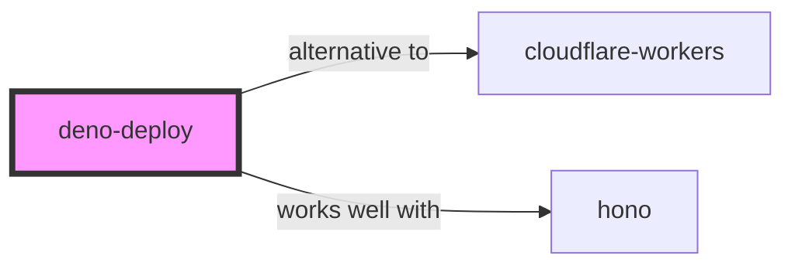

# Deno Deploy Skill

> Distributed system that runs JavaScript, TypeScript, and WebAssembly at the edge.

## Ecosystem Graph Preview



## Recommended Next Skills

- **[cloudflare-workers](/skills/cloudflare-workers)** (Score: 0.82)
  *Why: Direct relationship, Both are Cloud, Shared ecosystem (javascript), Similar network profile*
- **[hono](/skills/hono)** (Score: 0.62)
  *Why: Direct relationship, Shared ecosystem (javascript), Similar network profile*
- **[biome](/skills/biome)** (Score: 0.3)
  *Why: Both are Developer Tools, Shared ecosystem (javascript)*

## Quick Start
Deno Deploy natively executes TypeScript without any build step or compilation required. It isolates tenants using V8 isolates, providing incredible speed and security.

```bash
deloyctl deploy --project=my-project main.ts
```

## Production Patterns
### Deno KV
Use Deno KV for global, strongly consistent database storage built directly into the runtime. It requires zero configuration and provides ACID transactions.

## Architecture & Scaling
### Web Standard Modules
Deno completely ignores Node.js `node_modules` and `package.json`. You import modules directly via URLs (e.g., `import { serve } from 'https://deno.land/std/http/server.ts'`).

## Error Recovery
Deno strictly adheres to web standards. If an unhandled promise rejection occurs, the V8 isolate crashes. Always `await` and `catch` asynchronous network calls.

## Security Notes
Deno is secure by default. Even when running locally, it cannot access the disk, network, or environment variables unless you explicitly pass flags (e.g., `--allow-net`).

## References
- [Deno Deploy Docs](https://deno.com/deploy/docs)
