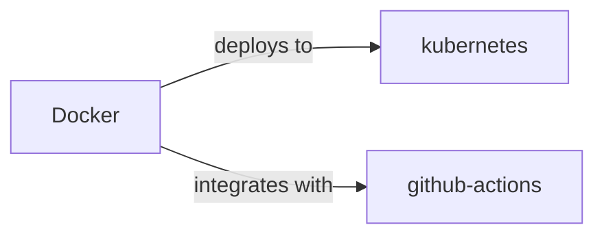

# Docker Skill

> OS-level virtualization to deliver software in packages called containers.

## Ecosystem Graph



## Quick Start
Docker packages your application and its dependencies into an immutable image, ensuring 'it works on my machine' scales to production.

```bash
docker build -t my-app .
docker run -p 8080:8080 my-app
```

## Production Patterns
### Multi-Stage Builds
Never ship build tools (like compilers or dev dependencies) in your final production image. Use a `build` stage to compile your code, then copy only the compiled artifacts into a distroless or alpine base image for the final stage.

## Architecture & Scaling
### Image Caching
Docker builds images in layers. Order your `Dockerfile` from least frequently changed (OS dependencies, package managers) to most frequently changed (source code). This ensures Docker caches the heavy steps and dramatically speeds up CI pipelines.

## Error Recovery
Use a process manager like PM2 or tini as `PID 1` inside your container to properly handle OS signals (SIGTERM/SIGINT) and reap zombie processes, allowing graceful shutdowns.

## Security Notes
Never run your container as the `root` user. Explicitly create and switch to a non-root `USER` at the end of your Dockerfile. Scan your images using tools like Trivy or Docker Scout to catch CVEs before deployment.

## Relationships
**Works Well With**: [github-actions](/skills/github-actions)

**Deploys To**: [kubernetes](/skills/kubernetes)

## References
- [Docker Docs](https://docs.docker.com/)
