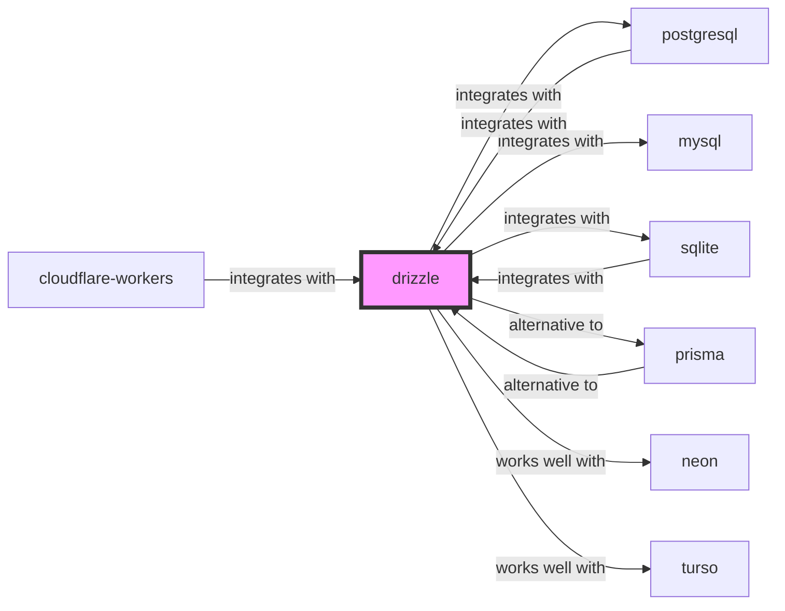

# Drizzle ORM Skill

> Next generation TypeScript ORM.

## Ecosystem Graph Preview



## Recommended Next Skills

- **[prisma](/skills/prisma)** (Score: 0.92)
  *Why: Direct relationship, Both are Databases, Shared ecosystem (typescript), Can deploy to vercel, Similar network profile*
- **[sqlite](/skills/sqlite)** (Score: 0.81)
  *Why: Direct relationship, Both are Databases, Can deploy to cloudflare, Similar network profile*
- **[cloudflare-workers](/skills/cloudflare-workers)** (Score: 0.8)
  *Why: Direct relationship, Both are Developer Tools, Can deploy to cloudflare*

## Quick Start
Drizzle is a headless TypeScript ORM. It generates pure SQL with zero runtime overhead, making it incredibly fast and compatible with Edge environments (Vercel Edge, Cloudflare Workers).

```bash
npm i drizzle-orm
```

## Production Patterns
### Relational Queries vs SQL-Like
Drizzle supports both traditional SQL-like querying and a Prisma-like `db.query` syntax. Use the `db.query` API for deeply nested relational fetches, but stick to the SQL-like syntax for complex aggregations and joins for maximum performance.

## Architecture & Scaling
### Zero Dependencies
Unlike Prisma, Drizzle does not require downloading a Rust binary engine. It is just JavaScript, meaning it natively supports serverless and edge functions without massive cold starts.

## Error Recovery
Always wrap multiple inserts/updates in a `db.transaction()`. If the underlying database driver throws an error, Drizzle will automatically issue the rollback.

## Security Notes
Drizzle utilizes prepared statements by default to completely mitigate SQL injection. Never concatenate raw strings inside `sql`` template literals.

## References
- [Drizzle Docs](https://orm.drizzle.team/)
