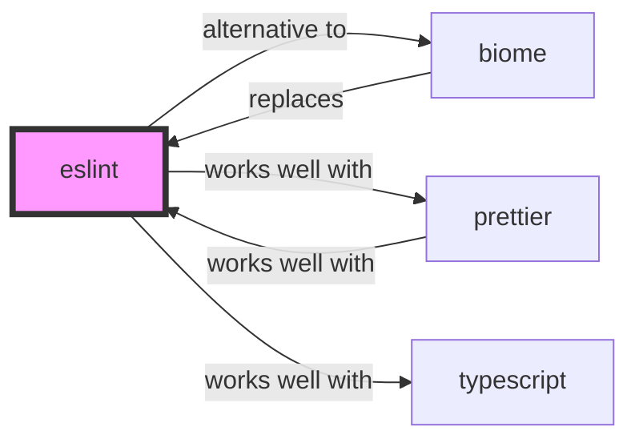

# ESLint Skill

> Find and fix problems in your JavaScript code.

## Ecosystem Graph Preview



## Recommended Next Skills

- **[biome](/skills/biome)** (Score: 0.95)
  *Why: Direct relationship, Both are Developer Tools, Shared ecosystem (javascript), Can deploy to any, Similar network profile*
- **[prettier](/skills/prettier)** (Score: 0.92)
  *Why: Direct relationship, Both are Developer Tools, Shared ecosystem (javascript), Can deploy to any, Similar network profile*
- **[bullmq](/skills/bullmq)** (Score: 0.35)
  *Why: Both are Developer Tools, Shared ecosystem (javascript), Logical next step*

## Quick Start
ESLint statically analyzes your code to quickly find problems. It is highly extensible via plugins.

```bash
npm init @eslint/config@latest
```

## Production Patterns
### Flat Config
ESLint v9 exclusively uses the new Flat Config system (`eslint.config.js`). It drops the complex cascading `.eslintrc` files in favor of a single array of configuration objects.

## Architecture & Scaling
### AST Parsing
ESLint parses JavaScript into an Abstract Syntax Tree (AST) and evaluates rules against it. When using TypeScript, you must configure `@typescript-eslint/parser` to allow ESLint to understand TS-specific syntax.

## Error Recovery
If linting becomes extremely slow, it is usually due to rules that require type information. Run type-aware linting only in CI, and disable those specific rules for your local IDE experience if the project is massive.

## Security Notes
Use `eslint-plugin-security` to detect potential vulnerabilities like Regex Denial of Service (ReDoS) or `eval()` usage directly in your source code.

## References
- [ESLint Docs](https://eslint.org/docs/latest/)

## Why use this skill
Use this when your agent works with **eslint** — structured patterns beat pasted docs and prevent common hallucinations.

## AI pitfalls
- Referencing CLI flags or config keys that do not exist
- Using outdated major versions of tools
- Skipping lockfile or version pinning in examples

## Production checklist
- [ ] Secrets in environment variables, not source code
- [ ] Error handling and logging in place
- [ ] Rate limits and timeouts configured

## Related skills
- [`biome`](../biome/SKILL.md) — alternative to
- [`prettier`](../prettier/SKILL.md) — works well with
- [`nextjs`](../nextjs/SKILL.md) — works well with
