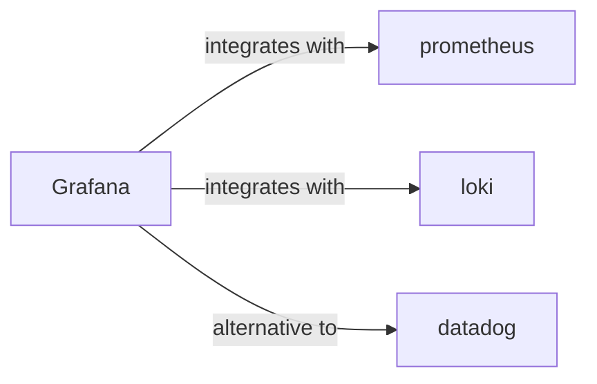

# Grafana Skill

> The open observability platform.

## Ecosystem Graph



## Quick Start
Grafana connects to disparate data sources (Prometheus, Loki, Postgres) and visualizes them on highly customizable dashboards.

```bash
docker run -d -p 3000:3000 grafana/grafana
```

## Production Patterns
### Provisioning as Code
Do not click around the Grafana UI to create critical production dashboards. Use Grafana's File Provisioning system (JSON/YAML) or Infrastructure as Code (Terraform) to version control your dashboards and alerts.

## Architecture & Scaling
### Unified Alerting
Grafana handles alerting natively. Define alert rules directly on the dashboard panels. Ensure Grafana is connected to a Notification Channel like Slack, PagerDuty, or Discord to route critical anomalies immediately.

## Error Recovery
If Grafana loses connection to its underlying database (SQLite by default, but should be Postgres in production), the UI will hang. Ensure high availability by clustering Grafana nodes backed by a managed PostgreSQL database.

## Security Notes
Never expose Grafana to the public internet without enforcing SSO (Single Sign-On) via Google, GitHub, or Okta. Disable basic authentication (`admin/admin`) immediately upon provisioning.

## Relationships
**Alternatives**: [datadog](/skills/datadog)

**Works Well With**: [prometheus](/skills/prometheus), [loki](/skills/loki)

## References
- [Grafana Docs](https://grafana.com/docs/)
