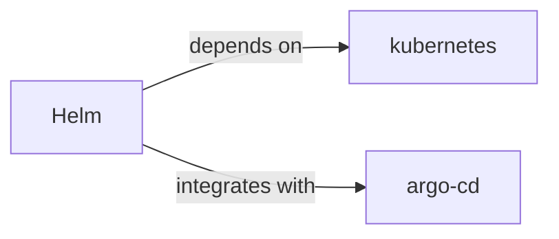

# Helm Skill

> The package manager for Kubernetes.

## Ecosystem Graph



## Quick Start
Helm packages Kubernetes YAML files into distributable 'Charts'. It allows templating YAML files so you can deploy identical apps to staging and production with different environment variables.

```bash
helm install my-release bitnami/redis
```

## Production Patterns
### Umbrella Charts
For complex microservice architectures, create an 'Umbrella' Helm chart that contains no templates of its own, but defines your individual microservice charts as dependencies in `Chart.yaml`. This allows deploying your entire ecosystem with a single command.

## Architecture & Scaling
### Values Overrides
Keep your chart templates generic. Define environment-specific configurations entirely within `values-staging.yaml` and `values-prod.yaml`. Pass these during installation: `helm upgrade -f values-prod.yaml ...`

## Error Recovery
Use `helm rollback <release> <revision>` to instantly revert a broken deployment. Helm tracks the history of deployed charts natively in Kubernetes Secrets.

## Security Notes
Do not store plaintext passwords in `values.yaml` files committed to Git. Use tools like HashiCorp Vault or `helm-secrets` (backed by SOPS) to inject encrypted values at deploy time.

## Relationships
**Prerequisites**: [kubernetes](/skills/kubernetes)

**Works Well With**: [argo-cd](/skills/argo-cd)

## References
- [Helm Docs](https://helm.sh/docs/)
