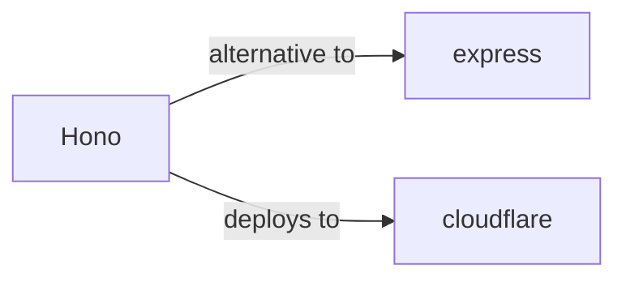

# Hono Skill

> Ultrafast web framework for the Edges.

## Ecosystem Graph



## Quick Start
Hono is designed specifically for Edge Runtimes (Cloudflare Workers, Deno, Bun, Fastly). It utilizes the standard Web Fetch API rather than Node.js specific APIs.

```bash
npm create hono@latest
```

## Production Patterns
### RPC (Remote Procedure Call)
Hono provides `hono/rpc` which allows you to share your backend route types with your frontend, enabling end-to-end type safety without generating OpenAPI schemas.

## Architecture & Scaling
### Web Standard APIs
Hono strictly uses the Web Standard `Request` and `Response` objects. You cannot use Node.js `res.send()` or `req.body`. Instead, you use `c.json()` and `await c.req.json()`.

## Error Recovery
Use `app.onError` to catch exceptions globally. Since Edge functions often fail due to network timeouts when communicating with external databases, implement retry mechanisms using libraries designed for the Web Fetch API.

## Security Notes
Hono includes built-in middleware for CSRF, CORS, and Basic Auth. When deploying to Cloudflare Workers, environment variables (secrets) are accessed via `c.env` rather than `process.env`.

## Relationships
**Alternatives**: [express](/skills/express)

**Deploys To**: [cloudflare](/skills/cloudflare)

## References
- [Hono Docs](https://hono.dev/)
