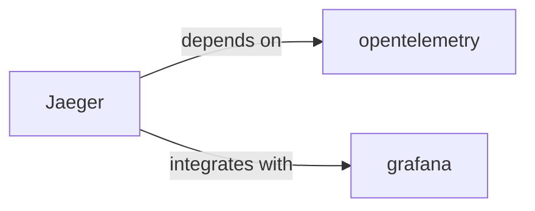

# Jaeger Skill

> Open source, end-to-end distributed tracing.

## Ecosystem Graph



## Quick Start
Jaeger receives distributed traces (usually from OpenTelemetry), stores them, and provides a UI to visualize the exact lifecycle of a request as it hops across multiple microservices.

```bash
docker run -d -p 16686:16686 -p 4317:4317 jaegertracing/all-in-one:latest
```

## Production Patterns
### Trace Sampling
Do not trace 100% of your requests in production. Use probabilistic sampling (e.g., 1%) or tail-based sampling (recording 100% of errors but only 1% of successful requests) to prevent Jaeger's storage backend from imploding.

## Architecture & Scaling
### Storage Backends
The `all-in-one` Docker image uses in-memory storage and will lose data upon restart. For production, you must configure Jaeger to use a durable storage backend like Elasticsearch or Cassandra.

## Error Recovery
If the Jaeger UI is incredibly slow, it is likely due to the underlying Elasticsearch database struggling to aggregate massive trace volumes. Optimize your ES cluster and ensure you are aggressively rotating old indices.

## Security Notes
Jaeger's UI has no built-in authentication mechanism. When deploying to Kubernetes, place it behind an OAuth2 Proxy or an Ingress controller configured with strict IP whitelisting.

## Relationships
**Prerequisites**: [opentelemetry](/skills/opentelemetry)

**Works Well With**: [grafana](/skills/grafana)

## References
- [Jaeger Docs](https://www.jaegertracing.io/docs/)

## Why use this skill
Use this when your agent works with **jaeger** — structured patterns beat pasted docs and prevent common hallucinations.

## AI pitfalls
- Using outdated SDK or API versions from training data
- Inventing environment variable names
- Omitting error handling and retry logic

## Production checklist
- [ ] Secrets in environment variables, not source code
- [ ] Error handling and logging in place
- [ ] Rate limits and timeouts configured

## Related skills
- [`opentelemetry`](../opentelemetry/SKILL.md) — depends on
- [`grafana`](../grafana/SKILL.md) — integrates with

---
> **Last Verified:** 2026-07-02
