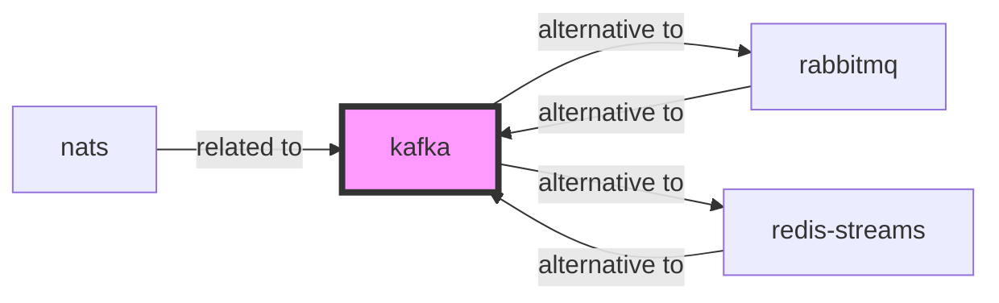

# Apache Kafka Skill

> Distributed event streaming platform.

## Ecosystem Graph Preview



## Recommended Next Skills

- **[rabbitmq](/skills/rabbitmq)** (Score: 0.9)
  *Why: Direct relationship, Both are Messaging, Shared ecosystem (infrastructure), Can deploy to aws*
- **[redis-streams](/skills/redis-streams)** (Score: 0.8)
  *Why: Direct relationship, Both are Messaging, Can deploy to aws*
- **[nats](/skills/nats)** (Score: 0.7)
  *Why: Direct relationship, Both are Messaging*

## Quick Start
Kafka is not a queue; it is a distributed, append-only log. It excels at handling massive event streams (like clickstreams or IoT telemetry) by distributing partitions across a cluster.

```bash
docker run -p 9092:9092 apache/kafka:latest
```

## Production Patterns
### Consumer Groups and Partitions
Kafka guarantees message ordering *only within a single partition*. To scale out, you must increase the number of partitions for a topic. The maximum number of concurrent consumers in a group is strictly equal to the number of partitions.

## Architecture & Scaling
### Log Retention
Unlike RabbitMQ where messages are deleted once consumed, Kafka retains messages on disk based on a retention policy (e.g., 7 days or 100GB). This allows new consumer groups to replay the entire history of events from the beginning.

## Error Recovery
If a consumer is too slow, Kafka will trigger a 'rebalance', pausing message processing for the entire group. Ensure your consumer's `max.poll.interval.ms` is tuned properly, and keep processing logic completely asynchronous from the polling loop.

## Security Notes
Enable SASL/SCRAM for client authentication and TLS for in-transit encryption. Kafka without security is completely open to the network.

## References
- [Kafka Docs](https://kafka.apache.org/documentation/)

## Why use this skill
Use this when your agent works with **kafka** — structured patterns beat pasted docs and prevent common hallucinations.

## AI pitfalls
- Using outdated SDK or API versions from training data
- Inventing environment variable names
- Omitting error handling and retry logic

## Production checklist
- [ ] Secrets in environment variables, not source code
- [ ] Error handling and logging in place
- [ ] Rate limits and timeouts configured

## Related skills
- [`rabbitmq`](../rabbitmq/SKILL.md) — alternative to
- [`redis-streams`](../redis-streams/SKILL.md) — alternative to
