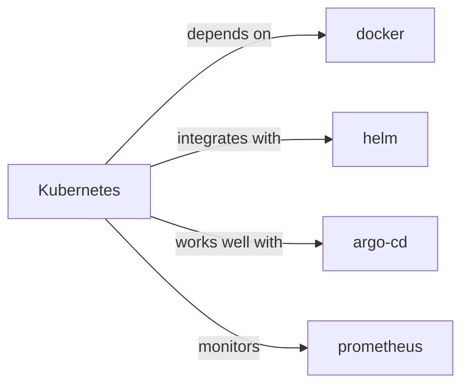

# Kubernetes Skill

> Automated container deployment, scaling, and management.

## Ecosystem Graph



## Quick Start
Kubernetes (K8s) orchestrates clusters of machines running containers. It declarative states (YAML) to manage Deployments, Services, and Ingresses.

```bash
kubectl apply -f deployment.yaml
```

## Production Patterns
### Operators
For complex stateful applications (like Postgres or Redis), do not manually manage StatefulSets. Use Kubernetes Operators (e.g., CrunchyData Postgres Operator) to handle backups, failovers, and version upgrades automatically.

## Architecture & Scaling
### Probes
Always define `livenessProbe` and `readinessProbe`. The liveness probe determines if the pod needs to be restarted. The readiness probe determines if the pod is ready to receive network traffic from the Service load balancer.

## Error Recovery
If pods frequently crash with `OOMKilled` (Out of Memory), ensure your `resources.limits.memory` is set correctly and matches the memory allocation limits of your runtime (e.g., Node.js `--max-old-space-size`).

## Security Notes
Enable RBAC (Role-Based Access Control). Do not grant default Service Accounts cluster-admin privileges. Utilize Network Policies to restrict pod-to-pod communication (e.g., only the backend can talk to the database).

## Relationships
**Prerequisites**: [docker](/skills/docker)

**Works Well With**: [helm](/skills/helm), [argo-cd](/skills/argo-cd)

## References
- [Kubernetes Docs](https://kubernetes.io/docs/home/)

## Why use this skill
Use this when your agent works with **kubernetes** — structured patterns beat pasted docs and prevent common hallucinations.

## AI pitfalls
- Referencing CLI flags or config keys that do not exist
- Using outdated major versions of tools
- Skipping lockfile or version pinning in examples

## Production checklist
- [ ] Secrets in environment variables, not source code
- [ ] Error handling and logging in place
- [ ] Rate limits and timeouts configured

## Related skills
- [`docker`](../docker/SKILL.md) — depends on
- [`helm`](../helm/SKILL.md) — integrates with
- [`argo-cd`](../argo-cd/SKILL.md) — works well with
- [`prometheus`](../prometheus/SKILL.md) — monitors
