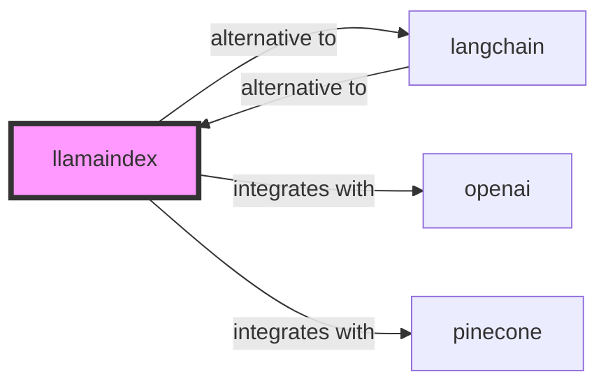

# LlamaIndex Skill

> Data framework for connecting custom data sources to large language models.

## Ecosystem Graph Preview



## Recommended Next Skills

- **[langchain](/skills/langchain)** (Score: 0.93)
  *Why: Direct relationship, Both are AI, Shared ecosystem (ai), Can deploy to any, Similar network profile*
- **[pinecone](/skills/pinecone)** (Score: 0.73)
  *Why: Direct relationship, Both are AI, Similar network profile*
- **[openai](/skills/openai)** (Score: 0.72)
  *Why: Direct relationship, Both are AI, Similar network profile*

## Quick Start
While LangChain focuses on Agents and Chains, LlamaIndex focuses heavily on Data. It is the premier framework for building advanced Retrieval-Augmented Generation (RAG) applications over unstructured data.

```bash
pip install llama-index
```

## Production Patterns
### Advanced Retrieval Strategies
Do not rely on naive Top-K semantic search. Production RAG requires advanced strategies like Sentence Window Retrieval (fetching the surrounding context of a hit), Auto-Merging Retrieval, or Re-ranking (using Cohere) to improve hallucination resistance.

## Architecture & Scaling
### Document Ingestion Pipeline
LlamaIndex handles the entire ingestion pipeline: Data Connectors (PDFs, Notion, SQL) -> Data Indexes (VectorStore, TreeIndex) -> Query Engines.

## Error Recovery
If the LLM complains about missing context, it means your Chunk Size is too small or your retrieval strategy is pulling irrelevant nodes. Inspect the `source_nodes` array attached to the LlamaIndex response to debug exactly what text was fed to the LLM.

## Security Notes
When ingesting documents, respect ACLs (Access Control Lists). Ensure that when User A queries the index, the retriever is strictly filtered to only pull vector embeddings derived from documents User A has permission to read.

## References
- [LlamaIndex Docs](https://docs.llamaindex.ai/)
