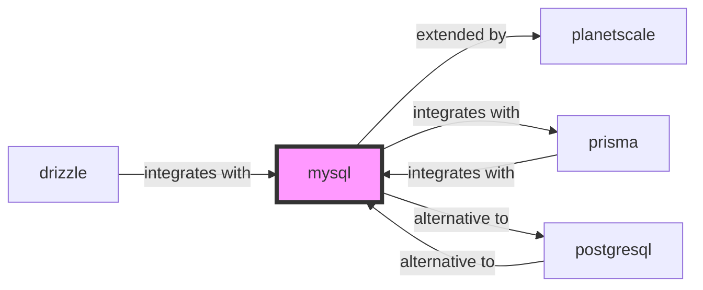

# MySQL Skill

> The world's most popular open source database.

## Ecosystem Graph Preview



## Recommended Next Skills

- **[postgresql](/skills/postgresql)** (Score: 0.93)
  *Why: Direct relationship, Both are Databases, Shared ecosystem (database), Can deploy to aws, Similar network profile*
- **[prisma](/skills/prisma)** (Score: 0.73)
  *Why: Direct relationship, Both are Databases, Similar network profile*
- **[drizzle](/skills/drizzle)** (Score: 0.72)
  *Why: Direct relationship, Both are Databases, Similar network profile*

## Quick Start
MySQL is highly optimized for read-heavy web workloads. The InnoDB storage engine provides robust ACID compliance.

```bash
docker run -d -p 3306:3306 -e MYSQL_ROOT_PASSWORD=secret mysql:8
```

## Production Patterns
### Index Optimizations
MySQL heavily relies on clustered indexes (the Primary Key). Always define an auto-incrementing integer or sequential UUID (UUID v7) as your primary key to prevent massive index fragmentation and page splits during high-volume inserts.

## Architecture & Scaling
### Replication
MySQL's asynchronous replication is the standard for scaling read traffic. Write to the Primary node, and read from Read Replicas, but ensure your application can handle the replication lag (milliseconds).

## Error Recovery
Use `EXPLAIN` to diagnose slow queries. If MySQL is performing a 'filesort' or full table scan, you are missing a critical composite index.

## Security Notes
Disable `local_infile` to prevent arbitrary file reading vulnerabilities. Ensure `sql_mode` includes `STRICT_ALL_TABLES` to prevent MySQL from silently truncating strings that exceed column lengths.

## References
- [MySQL Docs](https://dev.mysql.com/doc/)
