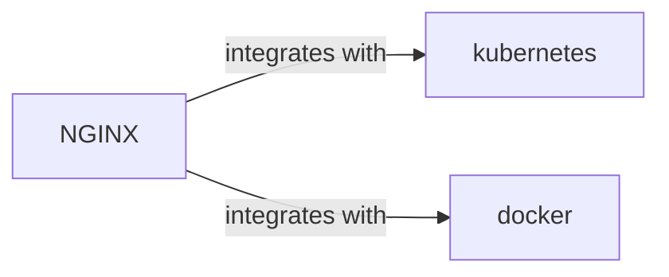

# NGINX Skill

> High performance load balancer, web server, and reverse proxy.

## Ecosystem Graph



## Quick Start
NGINX is primarily used in modern architectures as an Ingress Controller (in Kubernetes) or as a lightweight reverse proxy in front of Node.js/Python microservices to handle SSL termination and static file serving.

```bash
docker run -p 80:80 -v ./nginx.conf:/etc/nginx/nginx.conf nginx
```

## Production Patterns
### Node.js Reverse Proxying
Node.js is single-threaded and struggles with serving thousands of static assets simultaneously. Place NGINX in front to serve `/public` assets efficiently, and proxy `/api` traffic back to Node.js using `proxy_pass`.

## Architecture & Scaling
### Event-Driven Architecture
NGINX uses an asynchronous, event-driven architecture rather than allocating a thread per connection (like Apache). This allows it to handle tens of thousands of concurrent connections with minimal RAM usage.

## Error Recovery
If NGINX returns `502 Bad Gateway`, it means the backend service (e.g., your Express app) is crashed or unreachable. If it returns `504 Gateway Timeout`, your backend took longer to respond than the configured `proxy_read_timeout`.

## Security Notes
Always hide your server signature (`server_tokens off;`). Configure rate limiting (`limit_req_zone`) to protect your backend APIs from brute-force or DDoS attacks directly at the proxy layer.

## Relationships
**Works Well With**: [kubernetes](/skills/kubernetes), [docker](/skills/docker)

## References
- [NGINX Docs](https://nginx.org/en/docs/)
