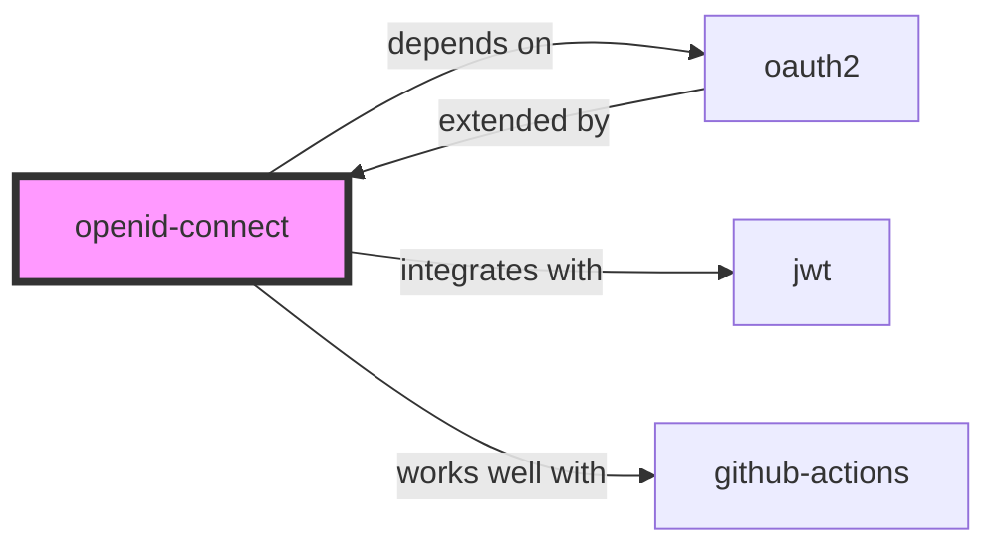

# OpenID Connect (OIDC) Skill

> Identity layer on top of the OAuth 2.0 protocol.

## Ecosystem Graph Preview

## Recommended Next Skills

- **[jwt](/skills/jwt)** (Score: 0.92)
  *Why: Direct relationship, Both are Authentication, Shared ecosystem (security), Can deploy to any, Similar network profile*
- **[oauth2](/skills/oauth2)** (Score: 0.92)
  *Why: Direct relationship, Both are Authentication, Shared ecosystem (security), Can deploy to any, Similar network profile*
- **[github-actions](/skills/github-actions)** (Score: 0.5)
  *Why: Direct relationship*

## Quick Start
While OAuth 2.0 is for *Authorization* (granting access to APIs), OIDC is for *Authentication* (verifying who the user is). It introduces the ID Token (a JWT).

## Production Patterns
### GitHub Actions OIDC
Never store long-lived AWS or GCP credentials in GitHub Actions secrets. Configure GitHub Actions as an OIDC Identity Provider in AWS/GCP. Your workflow requests a short-lived token verifying its repository identity, eliminating credential leakage.

## Architecture & Scaling
### ID Token vs Access Token
Do not send the ID Token to your backend API as proof of authorization. The ID Token is strictly for the frontend to know the user's name and email. The Access Token is what gets sent to the API in the `Authorization` header.

## Error Recovery
Always validate the `iss` (Issuer) and `aud` (Audience) claims in the ID Token. If they do not match your exact OIDC provider and application client ID, instantly reject the token.

## Security Notes
Fetch the provider's JWKS (JSON Web Key Set) dynamically to verify the ID token's cryptographic signature. Do not hardcode public keys, as identity providers rotate them frequently.

## References
- [OIDC](https://openid.net/connect/)

## Why use this skill
Use this when your agent works with **openid-connect** — structured patterns beat pasted docs and prevent common hallucinations.

## AI pitfalls
- Using outdated SDK or API versions from training data
- Inventing environment variable names
- Omitting error handling and retry logic

## Production checklist
- [ ] Secrets in environment variables, not source code
- [ ] Error handling and logging in place
- [ ] Rate limits and timeouts configured

## Related skills
- [`oauth2`](../oauth2/SKILL.md) — depends on
- [`jwt`](../jwt/SKILL.md) — integrates with
- [`github-actions`](../github-actions/SKILL.md) — works well with

---
> **Last Verified:** 2026-07-02
