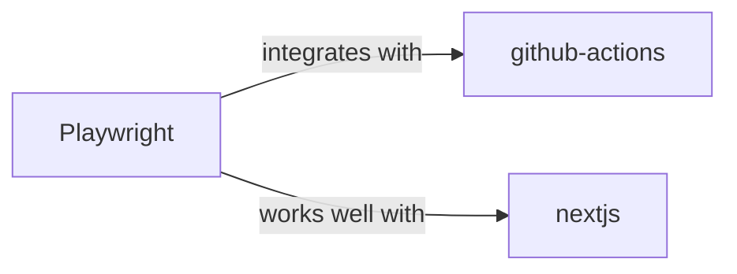

# Playwright Skill

> End-to-end testing for modern web apps.

## Ecosystem Graph



## Quick Start
Playwright is a framework for Web Testing and Automation. It runs headless browsers (Chromium, WebKit, Firefox) to simulate user interactions.

```bash
npm init playwright@latest
```

## Production Patterns
### Auto-Waiting and Locators
Never use `page.waitForTimeout(5000)`. Rely on Playwright's Locators (`page.getByRole('button')`) which automatically wait for the element to be visible, enabled, and stable before clicking.

## Architecture & Scaling
### Parallel Execution
Playwright runs tests in parallel by default using multiple worker processes. Ensure your backend database can handle concurrent test executions, or use isolated database branches (e.g., Neon) for each test shard.

## Error Recovery
If tests flake due to network latency, configure automatic retries in `playwright.config.ts` (`retries: process.env.CI ? 2 : 0`).

## Security Notes
Do not expose real user credentials in your test files. Seed a test database dynamically before the test run, or utilize dedicated test environment variables injected by the CI runner.

## Relationships
**Works Well With**: [github-actions](/skills/github-actions), [nextjs](/skills/nextjs)

## References
- [Playwright Docs](https://playwright.dev/docs/intro)

## Why use this skill
Use this when your agent works with **playwright** — structured patterns beat pasted docs and prevent common hallucinations.

## AI pitfalls
- Referencing CLI flags or config keys that do not exist
- Using outdated major versions of tools
- Skipping lockfile or version pinning in examples

## Production checklist
- [ ] Secrets in environment variables, not source code
- [ ] Error handling and logging in place
- [ ] Rate limits and timeouts configured

## Related skills
- [`github-actions`](../github-actions/SKILL.md) — integrates with
- [`nextjs`](../nextjs/SKILL.md) — works well with
