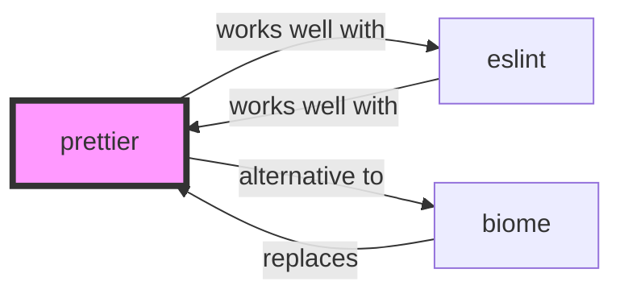

# Prettier Skill

> Opinionated Code Formatter.

## Ecosystem Graph Preview



## Recommended Next Skills

- **[biome](/skills/biome)** (Score: 0.92)
  *Why: Direct relationship, Both are Developer Tools, Shared ecosystem (javascript), Can deploy to any, Similar network profile*
- **[eslint](/skills/eslint)** (Score: 0.92)
  *Why: Direct relationship, Both are Developer Tools, Shared ecosystem (javascript), Can deploy to any, Similar network profile*
- **[bullmq](/skills/bullmq)** (Score: 0.35)
  *Why: Both are Developer Tools, Shared ecosystem (javascript), Logical next step*

## Quick Start
Prettier enforces a consistent code style across your entire codebase by parsing code and re-printing it with its own rules.

```bash
npm install --save-dev --save-exact prettier
```

## Production Patterns
### Formatting on Save
Do not rely on developers remembering to run the CLI. Integrate Prettier into VSCode (`formatOnSave: true`) and enforce it at the repository level using Husky and lint-staged.

## Architecture & Scaling
### Opinionated by Design
Prettier explicitly lacks configuration options. This is a feature, not a bug. It ends bikeshedding over code style in pull requests instantly.

## Error Recovery
If Prettier conflicts with ESLint (causing the code to flip back and forth on save), you MUST use `eslint-config-prettier` to turn off all ESLint rules that are unnecessary or might conflict with Prettier.

## Security Notes
Prettier has no significant security footprint as it only transforms ASTs. Ensure you are locking the exact version in `package.json` to prevent arbitrary formatting changes across the team.

## References
- [Prettier Docs](https://prettier.io/docs/en/)

## Why use this skill
Use this when your agent works with **prettier** — structured patterns beat pasted docs and prevent common hallucinations.

## AI pitfalls
- Referencing CLI flags or config keys that do not exist
- Using outdated major versions of tools
- Skipping lockfile or version pinning in examples

## Production checklist
- [ ] Secrets in environment variables, not source code
- [ ] Error handling and logging in place
- [ ] Rate limits and timeouts configured

## Related skills
- [`eslint`](../eslint/SKILL.md) — works well with
- [`biome`](../biome/SKILL.md) — alternative to
